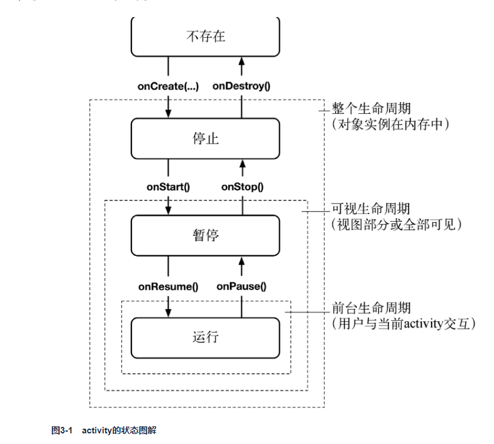
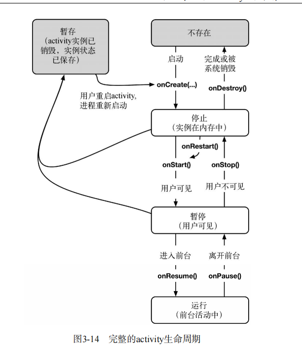

1. 每个Activity实例都有其生命周期。在其生命周期内，activity在运行、暂停、停止和不存在这四种状态间转换。每次状态转换时，都有相应的Activity方法发消息通知activity。图3-1显示了activity的生命周期、状态以及状态切换时系统调用的方法。


2. 在处理旋转屏幕的数据保存问题，可通过覆盖onSaveInstanceState(Bundle)方法，将一些数据以键值对的形式保存在bundle中，然后在onCreate(Bundle)方法中取回这些数据。
   该方法通常在onStop()方法之前由系统调用，除非用户按后退键。（记住，按后退键就是告诉Android，activity用完了。随后，该activity就完全从内存中被抹掉，自然，也就没有必要为重建保存数据了。）
   那么暂存的activity记录到底可以保留多久？前面说过，用户按了后退键后，系统会彻底销毁当前的activity。此时，暂存的activity记录同时被清除。此外，系统重启的话，暂存的activity记录也会被清除。
   ```java{.line-numbers}
   @Override
    protected void onSaveInstanceState(Bundle savedInstanceState) {
        super.onSaveInstanceState(savedInstanceState);
        Log.i(TAG, "onSaveInstanceState");
        savedInstanceState.putInt(KEY_INDEX, text_index);
    }
    ```
    在onCreate中取回数据
    ```java{.line-numbers}
    @Override
    protected void onCreate(Bundle savedInstanceState){
        super.onCreate(savedInstanceState);
        Log.d(TAG, "onCreate(Bundle) called");
        setContentView(R.layout.activity_main);
        if (savedInstanceState != null) {
            text_index= savedInstanceState.getInt(KEY_INDEX, 0);
        }
    ```
3. 在onPause()、onStop() 以及 onDestroy() 中需要保存的是那些需要永久化的数据，而不是保存用于恢复状态的数据，