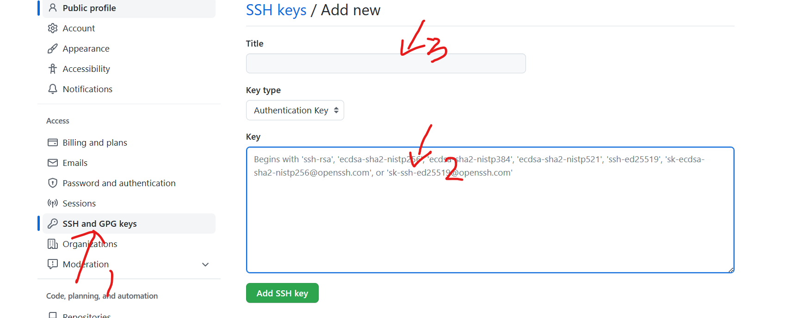

# git介绍

git:分布式版本控制工具，它具有以下几个概念

- **工作区**：就是你在电脑里能看到的目录。
- **暂存区**：英文叫 stage 或 index。一般存放在 **.git** 目录下的 index 文件（.git/index）中，所以我们把暂存区有时也叫作索引（index）。
- **版本库（本地库）**：工作区有一个隐藏目录 **.git**，这个不算工作区，而是 Git 的版本库。
- **远程仓库**：可以将本地仓库的项目push到远程仓库，也可以从远程仓库clone项目到本地查看

# 1.常用命令

## 1.1设置签名

首次使用必须设置以下两个命令，标识不同操作者的身份

- `git config --global user.name bigbigbird`
    设置用户名

- `git config --global user.email 12345678@qq.com`
    设置用户邮箱
    设置后可以在c盘用户目录下的.gitconfig下查看

## 1.2初始化本地库

- `git init`

    在d盘新建gitWorkSpace文件夹，git控制台进入gitWorkSpace目录，可以使用**git init**命令初始化本地库，会自动生成.git目录

- `ll -a`

    查看目录下的文件

- `git status`

    查看本地库状态

## 1.3添加文件到暂存区

- `git add [file1] [file]...`

    从工作区添加文件到暂存区。使用git add . 添加所有文件到暂存区。

## 1.4提交到本地库

- `git commit [file1] [file2] ... -m [message]`

    git commit 命令将暂存区内容添加到本地仓库中。git commit -am [message]加上-am 参数，可以忽略git add命令，直接提交。

    -m [message]设置提交信息，如果你没有设置 -m 选项，Git 会尝试为你打开一个编辑器以填写提交信息。 如果 Git 在你对它的配置中找不到相关信息，默认会打开 vim

- `git log`

    查看提交日志

- `git blame [file]`

    以列表形式查看指定文件的历史修改记录

## 1.5 版本回退

`git reset [--soft | --mixed | --hard] [HEAD]`

- `git reset --soft`

    把本地仓库回滚到某一个版本commit时的状态，暂存区和工作区保持不变

- `git reset`

    把本地仓库和暂存区回退到某一个版本，工作区保持不变

- `git reset --hard`

    同时把本地仓库、暂存区、工作区都回退到某一个版本，**切记！！！工作区有未提交的代码时不要用这个命令，因为工作区会回滚，你没有提交的代码就再也找不回了。**

**HEAD 说明：**

- HEAD 表示当前版本
- `HEAD^` 上一个版本
- `HEAD^^` 上上一个版本
- `HEAD^^^ `上上上一个版本

可以使用 ～数字表示

- HEAD~0 表示当前版本
- HEAD~1 上一个版本
- HEAD~2 上上一个版本
- HEAD~3 上上上一个版本

## 1.6克隆远程项目

- git clone [url] [name]

    url填写项目的网址，name（可选项）为项目保存到本地时的名字，当执行命令时，会把远程项目完整克隆到本地。

## 1.7文件删除

- `git rm <file>`

    将文件从从工作区、暂存区删除

- `git rm -f <file>`

    如果删除之前修改过并且已经放到暂存区域的话，需要加 -f 强制删除

- `git rm --cached [file]`

    从暂存区删除一个文件，工作区仍然保留这个文件

# 2.git分支

## 2.1查看分支

- `git branch`

    查看分支情况

- `git branch -v`

    查看分支情况以及版本信息

## 2.2创建、切换分支

- `git branch 分支名`

    创建一个新分支，该新分支会复制当前主分支的完整项目，版本为主分支的版本。

- `git checkout 分支名`

    切换分支，当你切换分支的时候，Git 会用该分支的最后提交的快照替换你的工作目录的内容， 所以多个分支不需要多个目录。

    当切换另一个分支进行修改，只要项目中同一个文件修改了，但是却没commit，即使切换回原来的分支，工作区也是显示刚刚切换分支时修改过的内容。

    也就是说如果切换到另一个分支进行了修改却没有commit，那么工作区的内容会保存这个未提交的分区的内容，即使切换到另一个分支。如果b分区新建一个文件(b.txt)却没有提交，跑去a分支提交b分区新建的文件(b.txt)，那么b分区将会丢失这个新建的文件(b.txt)。

## 2.3删除、合并分支

- `git branch -d 分支名`

    删除一个分支

- `git merge 分支名 -m 'message'`

    合并一个分支到当前选择分支

    假如当前处于master分支，执行git merge hot，将会把hot分支合并到master分支

    **当产生合并冲突，需要手动修改冲突的文件，可以通过vim进入冲突文件然后进行修改，然后使用git add 提交冲突的文件，再git commit命令提交，才能合并成功。**

# 3.github

github 网址：[https://github.com](https://github.com)

全球最大的男同交流网站，你还在等什么？进来打开新世界的大门！看点不一样的刺激项目！

## 3.1推送本地项目到远程库

首先GitHub仓库需要添加ssh key

在git bash中输入命令`$ ssh-keygen -t rsa -C "youremail@example.com"`,@后面改为自己GitHub的邮箱，成功的话会在 **~/** 下生成 **.ssh** 文件夹，进去，打开 **id_rsa.pub**，复制里面的 **key**。然后粘贴到GitHub上，并为这个key起个名字

- `git remote -v`

    显示所有远程仓库

- `git remote add [shortname] [url]`

    添加远程仓库的项目到本地，shortname是给仓库起的别名

- `git push <远程主机名> <本地分支名>:<远程分支名>`

    用于把本地项目上传到远程仓库，**注意：本地项目要先用git init命令初始化后，add、commit后，才能使用push命令上传。**

    如果本地分支名与远程分支名相同，可以忽略`:<远程分支名>`。

    `<远程主机名>`可以是远程仓库的url或者用git remote add时起的shortname。

- `git remote rm name`

    删除远程仓库

- `git remote rename old_name new_name`

    修改仓库别名

## 3.2远程获取代码并合并本地的版本

- `git pull <远程主机名> <远程分支名>:<本地分支名>`

    把远程主机名对应的分支合并到本地分支，如果忽略`:<本地分支名>`，默认将远程分支合并到现在控制台所显示的分支。

## 3.3远程仓库其他操作

- `git push origin --delete <branchName>`

    删除远程仓库的某个分支

- `git push origin --delete tag <tagname>`

    删除远程tag

- 