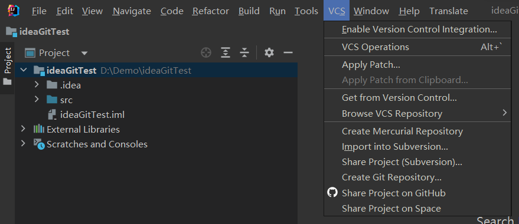
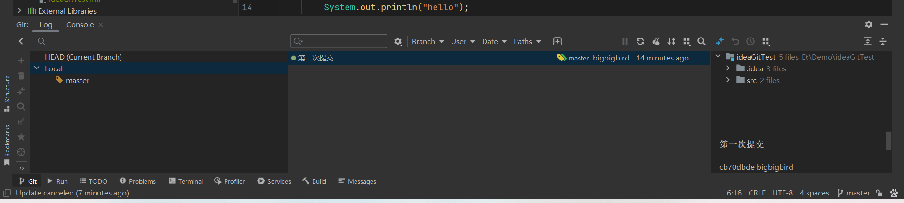

# 1idea的git操作

## 1.1初始化，添加，提交

点击vcs的create git repository即可初始化一个仓库。

在文件列表文件的颜色代表的意思：

- 红色

    表示文件未add到暂存区

- 绿色

    表示文件add了，没有commit

- 白色

    已经commit过，没有再修改过的文件

- 蓝色

    已经commit，但是有改动

- 灰色

    已经被版本控制忽略的文件，不会添加到版本控制中去

- 黄色

    被git忽略，不跟踪

黄色标签表示当前看的head指针所指向的版本，绿色标签表示某个分支所指向的版本。

## 2.2其他操作

可以在终端使用git命令操作。

