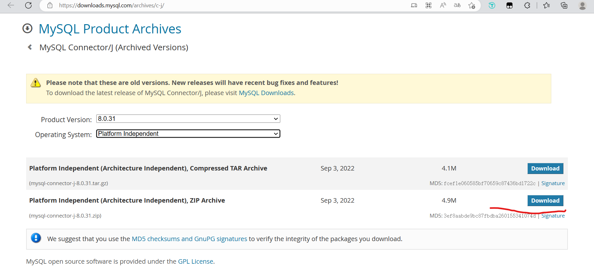
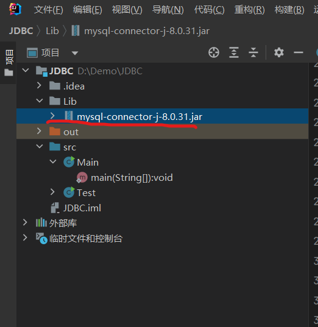
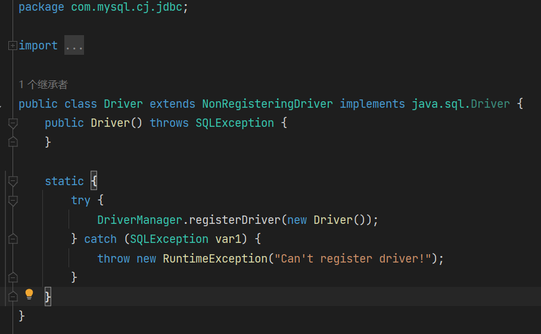

# 1.导入jar包

去数据库官网下载对应的jar包并导入

例如mysql,去[MySQL JDBC](https://downloads.mysql.com/archives/c-j/)下载对应的包,下载之后解压



解压之后导入项目,右键jar文件,把jar文件添加为库



# 2.具体使用

jdbc使用分6步

- 1.注册驱动
- 2.创建连接
- 3.创建statement(sql语句发送对象)
- 4.发送sql,获取结果
- 5.结果解析
- 6.关闭连接的资源

**示例:**

```java
public class Test {
    //jdbc:数据库厂商://ip地址:端口/数据库名?key=value&key=value
    public static final String URL="jdbc:mysql://localhost:3306/test1";
    private static final String DBNAME="root";
    public static final String PASSWORD="123456";

    public static void main(String[] args) throws ClassNotFoundException, SQLException {
        //注册驱动,8.0以上的mysql版本用的包名和8.0以下的不一样
        //8.0以下的为com.mysql.jdbc.Driver
        Class.forName("com.mysql.cj.jdbc.Driver");
        //创建连接
        Connection connection = DriverManager.getConnection(URL, DBNAME, PASSWORD);
        //创建statement
        Statement statement = connection.createStatement();
        String sql="select * from person";
        //执行sql获取result
        ResultSet resultSet = statement.executeQuery(sql);

        while(resultSet.next()){
            int id=resultSet.getInt("id");//获取id字段
            String name=resultSet.getString("name");//获取name字段
            System.out.println(id+":"+name);
        }
        //关闭资源
        resultSet.close();
        statement.close();
        connection.close();
    }
}
```

`Class.forName("com.mysql.cj.jdbc.Driver");`中，由于Driver类有个静态代码块中会注册驱动，所以在反射进行类加载的时候就会调用静态代码块注册驱动。

使用这种方式注册驱动，可以很方便的在框架中的配置文件中修改驱动的类，实现多种数据库的驱动注册



`DriverManager.getConnection()`中url参数，格式:`jdbc:数据库厂商://ip地址:端口/数据库名?key=value&key=value`?后面的部分为可选参数


`jdbc:mysql://localhost:3306/test1`如果是本机的3306端口号数据库，可以省略本机ip和端口号，写成`jdbc:mysql:///test1`

# 3.使用PreparedStatement

实际开发，使用PreparedStatement能够预防sql注入。

使用PreparedStatement需要先构建sql语句，使用?这个占位符替代需要传入的条件，通过setObject()方法设置?对应下标位置的参数

使用示例：

```java
//创建statement
String sql="select * from person where id=?;";
PreparedStatement preparedStatement = connection.prepareStatement(sql);
preparedStatement.setObject(1,2);
ResultSet resultSet = preparedStatement.executeQuery();
```

# 4.获取插入时的自增主键

在使用PreparedStatement插入数据时，可以获取mysql自增的id主键

```java
//携带Statement.RETURN_GENERATED_KEYS参数
PreparedStatement preparedStatement = connection.prepareStatement(sql1,Statement.RETURN_GENERATED_KEYS);
//获取自增的id主键
ResultSet generatedKeys = preparedStatement.getGeneratedKeys();
while (generatedKeys.next()){
    System.out.println(generatedKeys.getObject(1));
}
```

# 5.获取表的字段名称

```java
String sql="select id as i ,name from person";
PreparedStatement preparedStatement = connection.prepareStatement(sql);
ResultSet resultSet = preparedStatement.executeQuery();
//获取结果的属性字段信息
ResultSetMetaData metaData = resultSet.getMetaData();
//获取字段的个数
int columnCount = metaData.getColumnCount();
//获取第一个字段的名字,label还能获取到select设置的别名
String columnLabel = metaData.getColumnLabel(1);
System.out.println(columnCount);//2
System.out.println(columnLabel);//i
```

# 6.批量数据插入优化

1. 在url中添加参数`rewriteBatchedStatements=true`，开启mysql的批量插入
    `public static final String URL = "jdbc:mysql:///test1?rewriteBatchedStatements=true";`

2. 使用for循环批量插入

    ```java
    for (int i = 0; i < 10000; i++) {
        preparedStatement.setObject(1, "no "+i);
        //使用addBatch()方法追加数据
        preparedStatement.addBatch();
    }
    //使用executeBatch()方法执行批量插入
    preparedStatement.executeBatch();
    ```