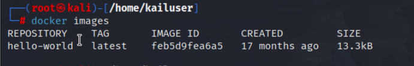
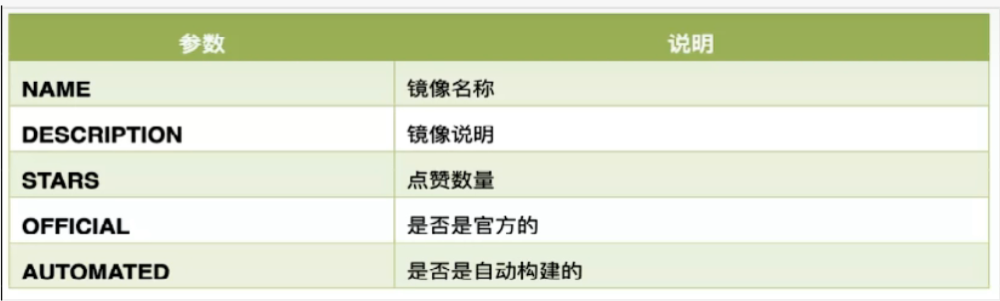
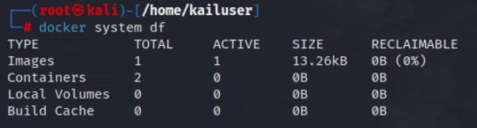

# 1.帮助启动类命令

`systemctl start docker`:启动docker

`systemctl stop docker`:停止docker

`systemctl restart docker`：重启docker

`systemctl status docker`：查看docker状态

`systemctl enable docker`：设置docker开机自启动

`docker info`：查看docker概要信息

`docker --help`：查看docker帮助

`docker 具体命名 --help`：查看docker具体命令帮助文档

`docker system df`：查看docker空间占用

# 2.镜像命令

`docker images [option]`:列出本地的所有镜像文件

-a:列出所有镜像

-q:只显示镜像id

REPOSITIRY:表示镜像的仓库源

TAG:镜像的标签版本号，latest表示最新的镜像，同一个仓库源可以有多个tag，表示不同的版本。  

IMAGE ID:镜像的id

CREATED:镜像的创建时间

SIZE:镜像大小

`docker search 镜像名字`：搜索某个镜像

`docker search --limit 5 镜像名字`：只列出5个

`docker pull 镜像名字[:TAG]`：下载镜像，没有tag默认下嘴最新的，设置tag下载指定版本

`docker system df`：查看docker占用的空间

`docker rmi 镜像名字|id`：删除某个镜象

`docker rmi -f $(docker images -qa)`：删除全部镜像

`docker image prune`：删除所有的虚悬镜像

# 3.容器命令

## 3.1容器创建

`docker run [OPTIONS] IMAGE [COMMAND] [ARG...]`:常用的参数：

- `--name`：为容器指定一个名称
- `-d`：后台运行容器并返回容器ID，也即启动守护式容器
- `-i`：以交互模式（interactive）运行容器，通常与`-t`同时使用
- `-t`：为容器重新分配一个伪输入终端（tty），通常与`-i`同时使用。也即启动交互式容器（前台有伪终端，等待交互）
- `-e`：为容器添加环境变量
- `-P`：大P 随机端口映射。将容器内暴露的所有端口映射到宿主机随机端口
- `-p`：小p 指定端口映射
- `-u, --user=""`， 指定容器的用户
- `--expose=[]`， 指定容器暴露的端口，即修改镜像的暴露端口
- `-h hostname`：指定容器的hostname
- `--ip`：在Docker中，可以使用`--ip`或者`--ip6`选项来指定为容器分配的IPv4或IPv6地址。这些选项可以在创建容器时使用
- `--restart="no"`， 指定容器停止后的重启策略:
    - no：容器退出时不重启
    - on-failure：容器故障退出（返回值非零）时重启
    - always：容器退出时总是重启
- `--privileged=false`， 指定容器是否为特权容器，特权容器拥有所有的capabilities

`-p`指定端口映射的几种不同形式：

- `-p hostPort:containerPort`：端口映射，例如`-p 8080:80`

- `-p ip:hostPort:containerPort`：配置监听地址，例如 `-p 10.0.0.1:8080:80`

- `-p ip::containerPort`：随机分配端口，例如 `-p 10.0.0.1::80`

- `-p hostPort1:containerPort1 -p hostPort2:containerPort2`：指定多个端口映射，例如`-p 8080:80 -p 8888:3306`

### 示例：

1. `docker run -it ubuntu bash`：启动一个Ubuntu容器，并新建一个终端和Ubuntu交互，使用ctrl+p+q可以退出交互式终端，退出后容器依然运行，使用 exit；也可以退出，但是会关闭容器。

2. `docker run -it --name=myubuntu ubuntu`：启动一个Ubuntu容器并设置名字为myubuntu。

3. `docker run -d 镜像名`：启动一个容器并在后台运行，如果使用`docker run -d ubuntu`尝试启动守护式的ubuntu，会发现容器启动后就自动退出了。

    因为Docker容器如果在后台运行，就必须要有一个前台进程。容器运行的命令如果不是那些一直挂起的命令（例如`top`、`tail`），就会自动退出。
    
4. `docker run -it -p 3306:3306 -e MYSQL_ROOT_PASSWORD=123456 -d mysql:8.0.32`：运行mysql8.0.32并设置密码，用户默认为root

## 3.2重新进入容器

`docker exec -it 容器ID bash`

`docker attach 容器ID`

`docker exec` 和 `docker attach` 区别：

- `attach`直接进入容器启动命令的终端，不会启动新的进程，用`exit`退出**会**导致容器的停止

- `exec`是在容器中打开新的终端，并且可以启动新的进程，用`exit`退出**不会**导致容器的停止

如果有多个终端，都对同一个容器执行了 `docker attach`，就会出现类似投屏显示的效果。一个终端中输入输出的内容，在其他终端上也会同步的显示。

## 3.3查看容器信息

`docker ps [OPTIONS]`：

- `-a`：列出当前所有正在运行的容器+历史上运行过的容器

- `-l`：显示最近创建的容器

- `-n`：显示最近n个创建的容器

- `-q`：静默模式，只显示容器编号

`docker logs 容器ID或容器名`:查看容器日志

`docker top 容器ID或容器名`:查看容器内运行的进程

`docker inspect 容器ID或容器名`:查看容器内部细节

## 3.4容器启停操作

`docker start 容器ID或容器名`:启动已经停止的容器

`docker restart 容器ID或容器名`：重启容器

`docker stop 容器ID或容器名`：停止容器

`docker kill 容器ID或容器名`：强制停止容器

## 3.5容器删除

`docker rm 容器ID或容器名`：删除已经停止的容器，-f强制删除

`docker rm -f $(docker ps -a -q)`:强制删除所有容器

## 3.6文件操作

`docker cp 容器ID:容器内路径 目的主机路径`：容器内文件拷贝到宿主机

`docker cp 主机路径 容器ID:容器内路径`：宿主机文件拷贝到容器中

`docker export 容器ID > tar文件名`：导出容器的内容流作为一个tar归档文件（对应`import`命令）；

`cat tar文件 | docker import - 自定义镜像用户/自定义镜像名:自定义镜像版本号`：从tar包中的内容创建一个新的文件系统再导入为镜像（对应`export`命令）

执行后生成一个镜像，可以运行。

## 3.7容器生成新镜像

在为容器添加新的软件后，可以生成自定义的镜像，镜像包含自己需要定制化添加的软件。

`docker commit -m="提交的描述信息" -a="作者" 容器ID 要创建的目标镜像名:[tag]`：提交容器副本，产生一个新的镜像

要创建的目标镜像名即REPOSITORY字段属性。

# 3.8容器数据卷

卷就是目录或文件，存在于一个或多个容器中，由docker挂载到容器，但不属于联合文件系统，因此能够绕过UnionFS，提供一些用于持续存储或共享数据。

特性：卷设计的目的就是数据的持久化，完全独立于容器的生存周期，因此Docker不会在容器删除时删除其挂载的数据卷。

特点：

- 数据卷可以在容器之间共享或重用数据

- 卷中的更改可以直接实施生效

- 数据卷中的更改不会包含在镜像的更新中

- 数据卷的生命周期一直持续到没有容器使用它为止

`docker run -it --privileged=true -v 宿主机绝对路径目录:容器内目录[: rw | ro] 镜像名`：启动一个容器，并挂载一个数据卷到容器，

其中rw为默认选项，表示容器中能对数据卷进行读写，ro表示只能对数据卷进行读操作。

其中可以通过多个-v挂载多个容器卷。

如果只填写一个目录，那么容器目录会自动创建并映射一个宿主机的目录。

**注意路径填绝对路径**

**示例：**

- `docker run -it  --privileged=true -v /home/kailuser/masterdata:/tmp/dockerdata:ro ubuntu bash`:

    启动Ubuntu容器示例，挂载宿主机的`/home/kailuser/masterdata`到容器的`/tmp/dockerdata`，注意填写**绝对路径**，ro设置docker容器只能读这个文件夹，不能写、添加文件！

## 3.8.1数据卷其他命令

`docker volume prune`：删除无用的数据卷

`docker volume ls`:列出所有容器数据卷

`docker volume rm name`：删除一个容器数据卷

# 4.镜像加速

登录阿里云[容器镜像服务 (aliyun.com)](https://cr.console.aliyun.com/cn-shenzhen/instances/mirrors)

按照提示修改文件：`/etc/docker/daemon.json`

然后使用`systemctl daemon-reload`和

`systemctl restart docker`重启docker