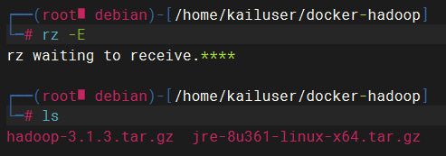
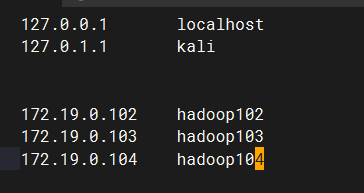
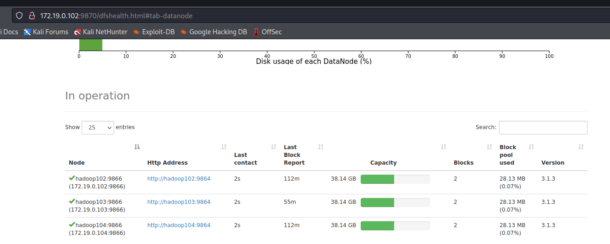
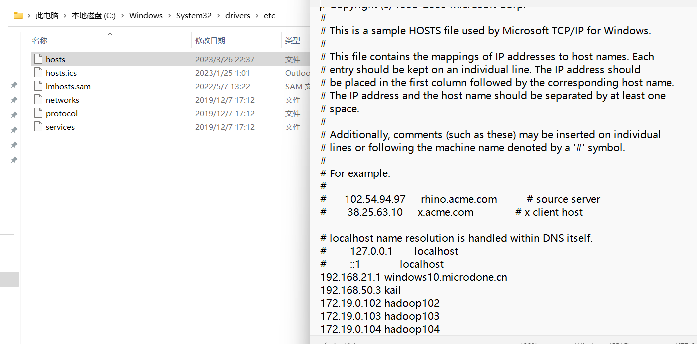
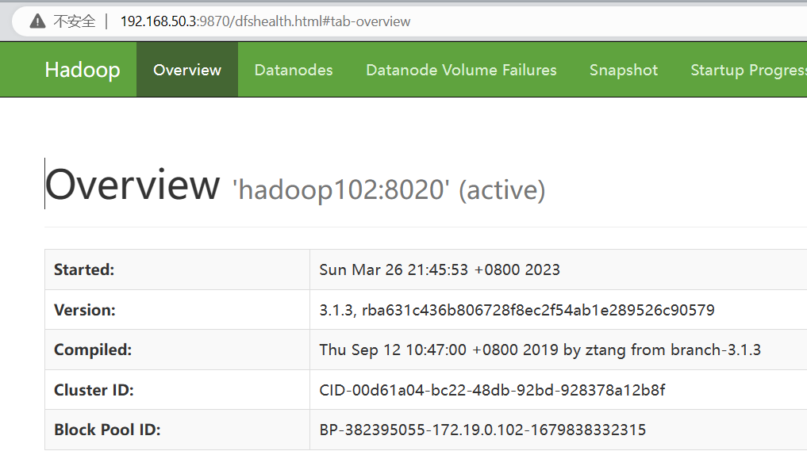

[JDK下载地址](https://www.oracle.com/java/technologies/downloads/#java8)

[hadoop下载地址](http://archive.apache.org/dist/hadoop/common/)

[Docker Engine 下载概览](https://docs.docker.com/engine/install/)

# 1.构建java与hadoop的基础镜像

1. 新建目录`mkdir docker-hadoop`

2. 使用`rz -E` 上传`jdk1.8`的`tar.gz`压缩包和hadoop3.1.3的压缩包


3. 编辑Dockerfile文件，构建一个带ssh、java、hadoop、vim环境的centos镜像

    ```dockerfile
    FROM centos:7.5.1804
    # 安装jdk、hadoop到/opt/service
    ADD jre-8u361-linux-x64.tar.gz hadoop-3.1.3.tar.gz /opt/service/
    # 设置工作目录
    WORKDIR /opt/service
    
    # 安装ssh服务并更换阿里云yum源
    RUN curl -o /etc/yum.repos.d/CentOS-Base.repo http://mirrors.aliyun.com/repo/Centos-7.repo && \
    	sed -i -e '/mirrors.cloud.aliyuncs.com/d' -e '/mirrors.aliyuncs.com/d' /etc/yum.repos.d/CentOS-Base.repo && \
    	yum makecache && \
    	yum install -y openssh-server openssh-clients && \
    	sed -i '/^HostKey/'d /etc/ssh/sshd_config && \
    	echo 'HostKey /etc/ssh/ssh_host_rsa_key' >> /etc/ssh/sshd_config && \
    	# 生成密匙
    	ssh-keygen -t rsa -b 2048 -f /etc/ssh/ssh_host_rsa_key && \
    	# 更改root用户登录密码
    	echo 'root:123456' | chpasswd && \
    	echo '#!/bin/bash'>>/opt/run.sh && \
    	echo '/usr/sbin/sshd -D'>> /opt/run.sh && \
    	chmod +x /opt/run.sh	
    # 暴露22端口
    EXPOSE 22
    CMD ["/opt/run.sh"]
    ```

    运行`docker build -t centos_hadoop:1.0 .`，生成镜像。

# 2.构建docker-compose 

1. 编辑`docker-compose.yml`，搭建三个节点的集群

    |      | hadoop102            | hadoop103                      | hadoop104                     |
    | :--- | :------------------- | :----------------------------- | ----------------------------- |
    | HDFS | NameNode \| DataNode | DataNode                       | SecondaryNameNode \| DataNode |
    | YARN | NodeManager          | ResourceManager \| NodeManager | NodeManager                   |

Hadoop 3.x 中常用的端口如下：

- 9870：NameNode Web 界面（HDFS）
- 8088：ResourceManager Web 界面（YARN）
- 9864：DataNode Web 界面（HDFS）
- 8042：NodeManager Web 界面（YARN）

`docker-compose.yml`：
```yaml
version: "3"
services:
  hadoop102:
    image: centos_hadoop:1.0
    container_name: hadoop102
    ports:
      - 9870:9870
      - 9000:9000
    hostname: hadoop102
    networks:
         my_network:
            ipv4_address: 172.19.0.102
    
  hadoop103:
    image: centos_hadoop:1.0
    container_name: hadoop103
    ports:
      - 9864:9864
      - 8088:8088
    hostname: hadoop103
    networks:
         my_network:
            ipv4_address: 172.19.0.103

  hadoop104:
    image: centos_hadoop:1.0
    container_name: hadoop104
    hostname: hadoop104
    networks:
         my_network:
            ipv4_address: 172.19.0.104
     

networks:
  my_network:
    ipam:
      driver: default
      config:
        - subnet: "172.19.0.0/16"
```
编辑好后使用`docker-compose config -q` 检查是否有错误输出，有错误请修改。
无错误使用`docker-compose up -d` 启动集群。

最新版的docker貌似没有docker-compose命令，而是docker comspose命令，少了一个 - 。

# 3.设置hadoop的配置并分发到其他机器

1. 由于Dockerfile中ENV设置的环境变量在ssh登录环境中会失效，所以用下面的方法解决

    

    使用`docker exec -it hadoop102 bash` 进入hadoop102 ，

    `vim /etc/profile.d/my_env.sh`

    ```sh
    export HDFS_NAMENODE_USER=root
    export HDFS_DATANODE_USER=root
    export HDFS_SECONDARYNAMENODE_USER=root
    export YARN_RESOURCEMANAGER_USER=root
    export YARN_NODEMANAGER_USER=root
    
    export JAVA_HOME=/opt/service/jre1.8.0_361
    export PATH=$PATH:$JAVA_HOME/bin
    
    #HADOOP_HOME
    export HADOOP_HOME=/opt/service/hadoop-3.1.3
    export PATH=$PATH:$HADOOP_HOME/bin
    export PATH=$PATH:$HADOOP_HOME/sbin
    ```

2. 配置ssh免密登录！由于hadoop需要ssh，所以先配置ssh免密登录。
    在hadoop102上执行 `ssh-keygen -t rsa` 生成密匙，然后将公钥拷贝到本地以及另外两台机器，使用

    `ssh-copy-id hadoop102`、`ssh-copy-id hadoop103`、`ssh-copy-id hadoop104`,
    同样的，**注意在hadoop103和hadoop104上也执行同样的操作，生成秘钥并拷贝到本地以及其他两台机器，配置免密登录。**
    
3. 修改hadoop的五个配置文件：`core-site.xml`、` hdfs-site.xml` 、`yarn-site.xml`、`mapred-site.xml`、`workers`
    进入hadoop存放配置文件的目录`cd /opt/service/hadoop-3.1.3/etc/hadoop`，**上面的配置文件都是在这个目录下！**

    `vim core-site.xml` 修改core-site.xml

    ```xml
    <configuration>
        <!-- 指定NameNode的地址 -->
        <property>
            <name>fs.defaultFS</name>
            <value>hdfs://hadoop102:8020</value>
        </property>
    
        <!-- 指定hadoop数据的存储目录 -->
        <property>
            <name>hadoop.tmp.dir</name>
            <value>/opt/service/hadoop-3.1.3/data</value>
        </property>
    
        <!-- 配置HDFS网页登录使用的静态用户为root -->
        <property>
            <name>hadoop.http.staticuser.user</name>
            <value>root</value>
        </property>
        <!--web console cors settings-->
        <property>
        <name>hadoop.http.filter.initializers</name>
            <value>org.apache.hadoop.security.HttpCrossOriginFilterInitializer</value>
    </property>
        <property>
            <name>hadoop.http.cross-origin.enabled</name>
            <value>true</value>
        </property>
        <property>
            <name>hadoop.http.cross-origin.allowed-origins</name>
            <value>*</value>
        </property>
        <property>
            <name>hadoop.http.cross-origin.allowed-methods</name>
            <value>GET,POST,HEAD</value>
        </property>
        <property>
            <name>hadoop.http.cross-origin.allowed-headers</name>
        <value>X-Requested-With,Content-Type,Accept,Origin</value>
        </property>
    <property>
            <name>hadoop.http.cross-origin.max-age</name>
            <value>1800</value>
        </property>
    </configuration>
    ```
    
    `vim hdfs-site.xml` 
    
    ```xml
    <configuration>
    	<!-- nn web端访问地址-->
    	<property>
            <name>dfs.namenode.http-address</name>
            <value>hadoop102:9870</value>
        </property>
    	<!-- 2nn web端访问地址-->
        <property>
            <name>dfs.namenode.secondary.http-address</name>
            <value>hadoop104:9868</value>
        </property>
    </configuration>
    ```
    
    `vim yarn-site.xml`
    
    ```xml
    <configuration>
        <!-- 指定MR走shuffle -->
        <property>
            <name>yarn.nodemanager.aux-services</name>
            <value>mapreduce_shuffle</value>
        </property>
    
        <!-- 指定ResourceManager的地址-->
        <property>
            <name>yarn.resourcemanager.hostname</name>
            <value>hadoop103</value>
    </property>
    
    <!-- 环境变量的继承 -->
        <property>
            <name>yarn.nodemanager.env-whitelist</name>
            <value>JAVA_HOME,HADOOP_COMMON_HOME,HADOOP_HDFS_HOME,HADOOP_CONF_DIR,CLASSPATH_PREPEND_DISTCACHE,HADOOP_YARN_HOME,HADOOP_MAPRED_HOME</value>
        </property>
        
        <!-- 开启日志聚集功能 -->
        <property>
            <name>yarn.log-aggregation-enable</name>
            <value>true</value>
        </property>
        <!-- 设置日志聚集服务器地址 -->
        <property>  
            <name>yarn.log.server.url</name>  
            <value>http://hadoop102:19888/jobhistory/logs</value>
        </property>
        <!-- 设置日志保留时间为7天 -->
        <property>
            <name>yarn.log-aggregation.retain-seconds</name>
            <value>604800</value>
        </property>
    </configuration>
    ```
```
    
    `vim mapred-site.xml`
    
    ```xml
    <configuration>
    	<!-- 指定MapReduce程序运行在Yarn上 -->
        <property>
            <name>mapreduce.framework.name</name>
            <value>yarn</value>
        </property>
        
        <!-- 历史服务器端地址 -->
        <property>
            <name>mapreduce.jobhistory.address</name>
            <value>hadoop102:10020</value>
        </property>
    
        <!-- 历史服务器web端地址 -->
        <property>
            <name>mapreduce.jobhistory.webapp.address</name>
            <value>hadoop102:19888</value>
        </property>
    </configuration>
```

4. 修改配置文件workers，`vim workers`，把原本的localhost删除

    ```
    hadoop102
    hadoop103
    hadoop104
    ```

    注意：该文件中添加的内容结尾不允许有空格，文件中不允许有空行

5. 配置日志
    日志聚集概念：应用运行完成以后，将程序运行日志信息上传到HDFS系统上。

    日志聚集功能好处：可以方便的查看到程序运行详情，方便开发调试。

    注意：开启日志聚集功能，需要重新启动NodeManager 、ResourceManager和HistoryServer。本步骤上面已经做过

    `vim yarn-site.xml`

    ```xml
    <!-- 开启日志聚集功能 -->
    <property>
        <name>yarn.log-aggregation-enable</name>
        <value>true</value>
    </property>
    <!-- 设置日志聚集服务器地址 -->
    <property>  
        <name>yarn.log.server.url</name>  
        <value>http://hadoop102:19888/jobhistory/logs</value>
    </property>
    <!-- 设置日志保留时间为7天 -->
    <property>
        <name>yarn.log-aggregation.retain-seconds</name>
        <value>604800</value>
    </property>
    ```

6. 以上的步骤都是在hadoop102上设置的，我们需要用scp把这些设置分发到其他两个服务器上，更新他们的配置。

    `scp -r /opt/service/hadoop-3.1.3/etc/hadoop hadoop103:/opt/service/hadoop-3.1.3/etc`

    `scp -r /opt/service/hadoop-3.1.3/etc/hadoop hadoop104:/opt/service/hadoop-3.1.3/etc`

    `scp -r /etc/profile.d/my_env.sh hadoop103:/etc/profile.d`

    `scp -r /etc/profile.d/my_env.sh hadoop104:/etc/profile.d`

7. 初始化namenode，在hadoop102上执行`hdfs namenode -format`

8. 启动hdfs，在hadoop102上执行`start-dfs.sh`

9. 启动yarn，使用`docker exec -it hadoop103 bash`进入hadoop103，在hadoop103上执行`start-yarn.sh`

**补充**：

这时候虚拟机进去namenode web 查看ip与节点的关系
链接格式：(http://192.19.0.103:9870/dfshealth.html#tab-datanode) 注意ip地址为namenode的地址

然后修改`/etc/hosts`文件，修改了之后就可以在虚拟机的网页上传文件了




**这时候去window打开namenode网页是无法上传的**

**如果想要在windows上传文件，windows请添加到虚拟机ip（192.168.50.3）的路由`route add 172.19.0.0 mask 255.255.0.0 192.168.50.3`，然后修改windows的host文件并保存 替换，映射ip与hadoop集群的关系**
然后访问http://hadoop102:9870/dfshealth.html#tab-overview ，ip地址注意去windows的hosts文件配置映射。还有！！如果开了梯子之类的玩意会访问失败！！！






可以退出容器，使用docker cp命令备份设置文件，方便以后错误了删除集群重新配置。

`docker cp hadoop102:/etc/profile.d/my_env.sh ./my_env.sh`

`docker cp hadoop102:/opt/service/hadoop-3.1.3/etc/hadoop ./hadoop`

