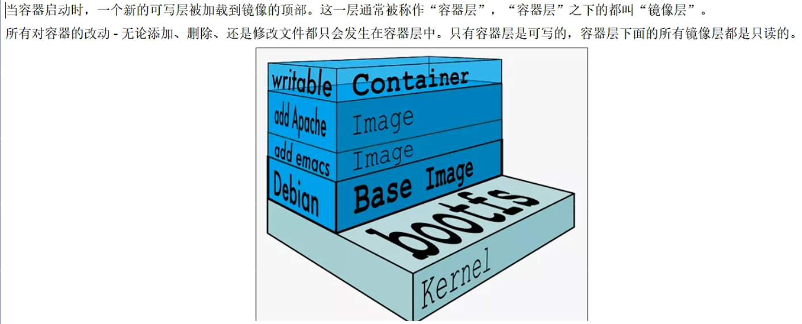

# 1.什么是docker

docker是一种容器化技术，不同于虚拟机需要加载一个操作系统的所有东西，docker可以根据软件需要，创建运行时所需要的最小依赖，从而减少资源的浪费。

docker的安全性和隔离性不如虚拟机，但是部署应用要比用虚拟机快。

Docker有比虚拟机更少的抽象层：

由于Docker不需要Hypervisor（虚拟机）实现硬件资源虚拟化，运行在Docker容器上的程序直接使用的都是实际物理机的硬件资源，因此在CPU、内存利用率上docker有明显优势。

Docker利用的是宿主机的内核，而不需要加载操作系统OS内核：

当新建一个容器时，Docker不需要和虚拟机一样重新加载一个操作系统内核。进而避免引寻、加载操作系统内核返回等比较耗时耗资源的过程。当新建一个虚拟机时，虚拟机软件需要加载OS，返回新建过程是分钟级别的。而Docker由于直接利用宿主机的操作系统，则省略了返回过程，因此新建一个docker容器只需要几秒钟。

Docker容器的本质就是一个进程。

docker是基于linux运行的，即使安装windows版，还是要建立一个linux虚拟机环境。

# 2.镜像，容器，仓库

Docker镜像就是一个只读的模板。镜像可以用来创建Docker容器，一个镜像可以创建多个容器。

Docker利用容器独立运行的一个或一组应用，应用程序或服务运行在容器里面，容器就类似于一个虚拟化的运行环境，容器是用镜像创建的运行实例。

Docker仓库是集中存放镜像文件的场所。

仓库分为公开仓库和私有仓库两种。

最大的公开仓库是Docker官方的Docker Hub：https://hub.docker.com/

# 3.虚悬镜像

镜像名、标签都是<none>的镜像，没什么用，可以删除

# 4.镜像的分层概念

UnionFS(联合文件系统):Union文件系统(UnionFS)是一种分层、轻量级并且高性能的文件系统，它支持对文件系统的修改作为一次提交来一层层的叠加，同时可以将不同目录挂载到同一个虚拟文件系统下(unite several directories into a single virtual filesystem)。Union文件系统是Docker镜像的基础。镜像可以通过分层来进行继承，基于基础镜像（没有父镜像)，可以制作各种具体的应用镜像。

特性:一次同时加载多个文件系统，但从外面看起来，只能看到一个文件系统，联合加载会把各层文件系统叠加起来，这样最终的文件系统会包含所有底层的文件和目录。

docker的镜像实际上由一层一层的文伴系统组成，这种层级的文件系统UnionFS
bootfs(boot fle system)主要包含bootioader和kernel, bootloader主要是引导加载kernel, Linux刚启动时会加载bootfs文件系统，在Docker镜像的最底层是引导文件系统bootfs。这一层与我们典型的Linux/Unix系统是一样的，包含bootfs加载器和内核。当boot加载完成之后整个内核就都在内存中了，此时内存的使用权已由bootfs转交给内核，此时系统也会卸载bootfs。
rootfs (root file system)，在bootfs之上。包含的就是典型Linux系统中的/dev, /proc, /bin, /etc等标准目录和文件。rootfs就是各种不同的操作系统发行版，比如Ubuntu，Centos等等。

由于镜像是一层一层分层的，所以可以进行复用、共享。

