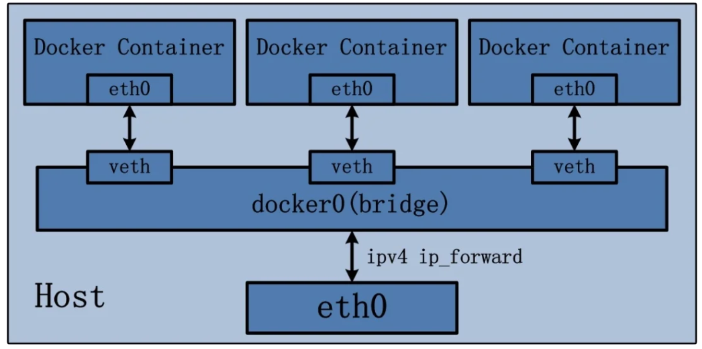
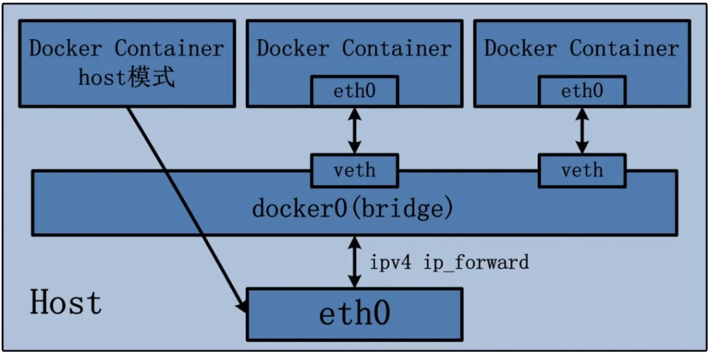
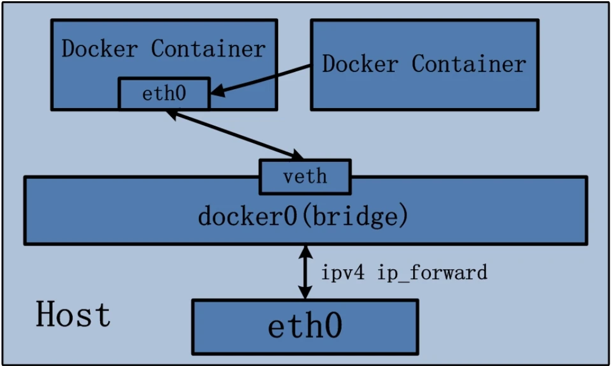

# 1.docker网络模式

docker有四种网络模式：

1. **bridge**  使用方式：`--network bridge`

    为每一个容器分配、设置IP等，并将容器连接到一个`docker0`虚拟网桥，**默认为该模式**

    Docker使用Linux桥接，在宿主机虚拟一个`Docker`容器网桥（`docker0`），Docker启动一个容器时会根据`Docker`网桥的网段分配给容器一个IP地址，称为`Container-IP`，同时Docker网桥是每个容器的默认网关。因为在同一个宿主机内的容器接入同一个网桥，这样容器之间就能够通过容器的`Container-IP`直接通信。

    `docker run`的时候，没有指定`--network`的话，默认使用的网桥模式就是`bridge`，使用的就是`docker0`。在宿主机`ifconfig`就可以看到`docker0`和自己`create`的`network`。

    网桥`docker0`创建一对对等虚拟设备接口，一个叫`veth`，另一个叫`eth0`，成对匹配：

    整个宿主机的网桥模式都是`docker0`，类似一个交换机有一堆接口，每个接口叫 `veth`，在本地主机和容器内分别创建一个虚拟接口，并让他们彼此联通（这样一对接口叫做 `veth pair`）。

    每个容器实例内部也有一块网卡，容器内的网卡接口叫做`eth0`。

    `docker0`上面的每个`veth`匹配某个容器实例内部的`eth0`，两两配对，一一匹配。

    

2. **host**  使用方式：`--network host`

    容器将不会虚拟出自己的网卡、配置自己的IP等，而是使用宿主机的IP和端口。

    

3. **none **  使用方式:`--network none`

    容器有独立的 Network namespace，但并没有对齐进行任何网络设置，如分配 `veth pari` 和 网桥连接、IP等，禁用网络功能。

    在`none`模式下，并不为docker容器进行任何网络配置。进入容器内，使用 `ip addr`查看网卡信息，只能看到 `lo`（本地回环网络`127.0.0.1`网卡）。

    

4. **container**  使用方式：`--network container:容器NAME或者容器ID`

    新创建的容器不会创建自己的网卡和配置自己的IP，而是和一个指定的容器共享IP、端口范围等，如果左边共享网络的容器关闭，右边共享其他容器网络的那个容器的网络也会一起消失。

    

# 2.docker网络命令

- `docker network ls`： 查看Docker网络模式

- `docker network add 网络名称`：添加docker网络

- `docker network rm 网络名称`：删除docker网络

- `docker network inspect 网络名称`：查看网络详细信息

- `docker network prune`：删除所有无效网络

    

# 3.自定义网络

在run一个容器时，先创建一个自定义的网络，`docker network create my_network`

然后run的时候指定这个自定义的网络

`docker run -it --network my_network --name u1 ubuntu bash`

`docker run -it --network my_network --name u2 ubuntu bash`

这时候在u1可以直接使用`ping u2`就可以ping通，不需要ip地址。