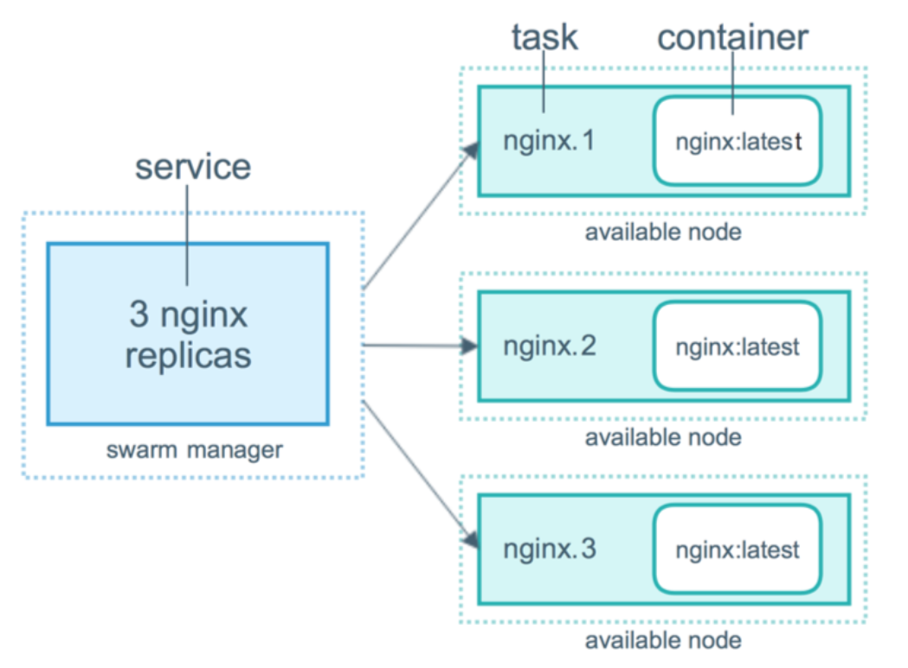
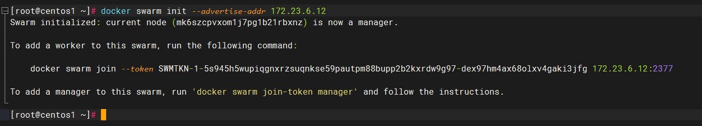

# 1.docker swarm

docker swarm可以实现在一台机器上管理多台机器上的docker。比如阿里云，你有好几台服务器，都安装了docker，如果手动管理一台台机子上的docker并创建容器实在太麻烦了，可以通过swarm进行小集群的管理，超过10台建议上k8s。

它里面有四个比较重要的概念：

- **swarm manager node**：负责管理所有加入了swarm集群的docker，它可以创建service，然后自动把service分配到集群中的docker来运行。
- **worker node**：这个节点负责运行task，也就是运行具体的应用如mysql、springboot服务等。
- **service：service**：包含了一个或多个task，由manager节点的docker负责创建，并分发service中的task到worker node节点运行
- **task**：具体的任务，即应用；可以是mysql、redis、tomcat等。

# 

# 2.swarm集群初始化

1. `docker swarm init [OPTIONS]` manager节点初始化需要用到该命令，用该命令初始化了一个manager节点后，会提示一行命令用于worker节点加入swarm集群

    options：

    - `--advertise-addr` 指定manager节点的公布ip，方便其他worker节点加入swarm集群。一般都是让集群在同一个局域网，然后指定manager节点的公布ip为内部局域网的ip。如果不是同一个局域网的服务器，应该使用公网ip。

    

上面使用内网的ip创建了一个maneger节点。

2. `docker swarm join --token SWMTKN-1-5s945h5wupiqgnxrzsuqnkse59pautpm88bupp2b2kxrdw9g97-dex97hm4ax68olxv4gaki3jfg 172.23.6.12:2377` 

    在worker节点上运行提示的命令，即可加入步骤1这个maneger节点的swarm集群。注意关闭iptables，firewall等防火墙，否则节点之间通信可能会被拦截。

    而想要退出集群，使用 `docker swarm leave -f` 命令

    当把工作节点都加入集群后，可以使用`docker info`查看本节点的swarm信息，在管理节点使用`docker node ls`查看节点信息

    其他命令：

    `docker node demote 节点id` 把管理节点降级为工作节点

    `docker node promote 节点id` 把工作节点升级为管理节点

    `docker node rm 节点id -f` 在管理节点上运行此命令强制删除一个节点，不使用-f无法删除一个不是down状态的节点，被删除的节点想要重新加入另一个集群先使用`docker swarm leave`命令退出之前的集群

    

# 3.创建service

1. `docker service create `命令可以创建服务
    示例：`docker service create --replicas 2 --name nginx_service -p 80:80 nginx`
    该命令创建了一个nginx_service服务，--replicas指定了2个task，也就是说nginx_service服务包含两个task，task是运行nginx，这两个task会自动分配到集群的worker节点，节点会自动创建nginx容器并运行。--name指定服务名，-p指定端口映射

    服务提供的模式有两种：
    
    - replicated：复制服务，复制指定服务到集群的机器上。
    - global：全局服务，服务将部署至集群的每个节点。
    
2. `docker service ps nginx_service` 可以查看服务运行的情况，服务运行在那些节点。

    `docker service ls ` 查看创建的服务
    `docker service inspect 服务名` 查看服务详情

    `docker service rm 服务名` 删除服务，同时停止容器

    `docker service update --replicas 1 服务名` 更新服务的设置，设置服务的replicas为1

# 4.docker stack

使用docker swarm只能部署单个服务，而使用docker stack可以利用docker-compose文件部署多个服务。相比单纯使用docker-compose，一个是单机部署，一个是多机器部署。

- `docker stack deploy` 部署新的堆栈或更新现有堆栈
- `docker stack ls` 列出现有堆栈
- `docker stack ps` 列出堆栈中的任务
- `docker stack rm` 删除一个或多个堆栈
- `docker stack services` 列出堆栈中的服务

