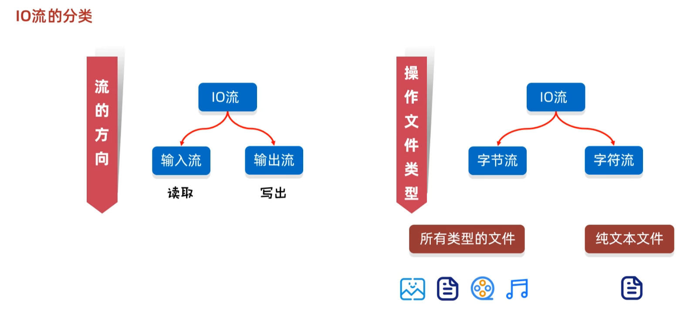
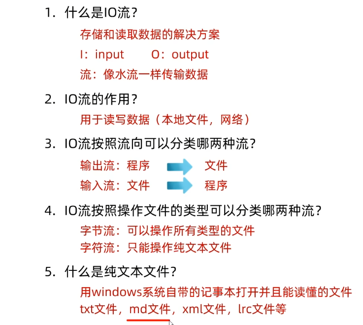
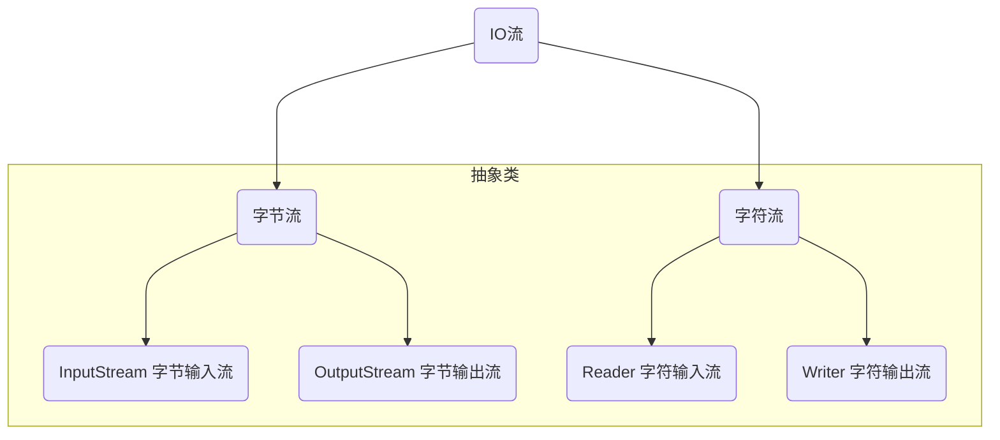
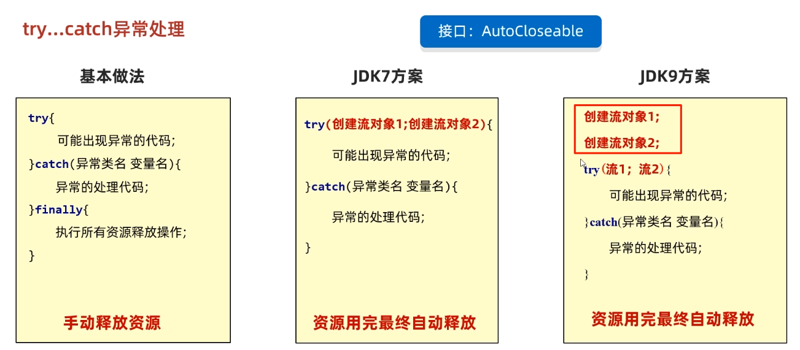
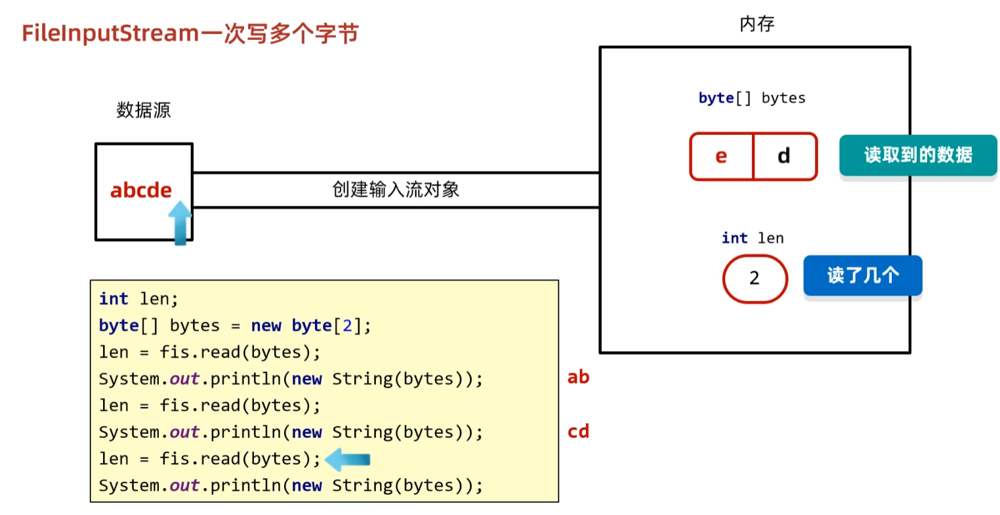
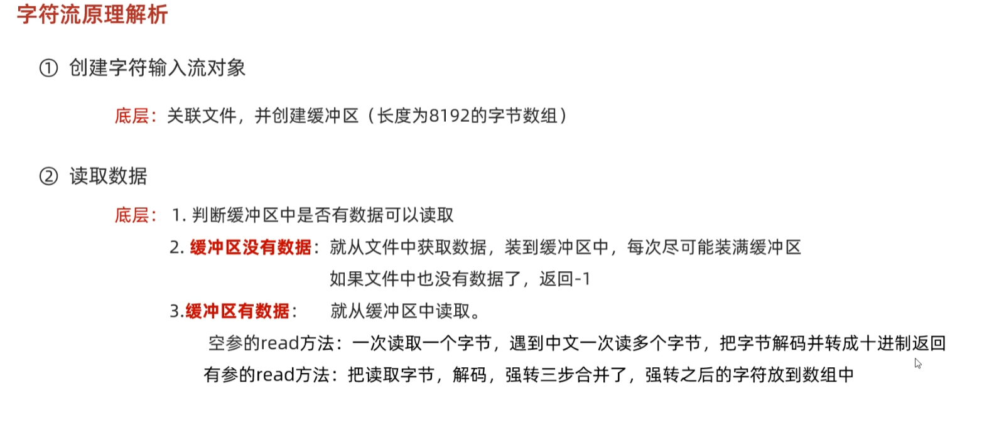
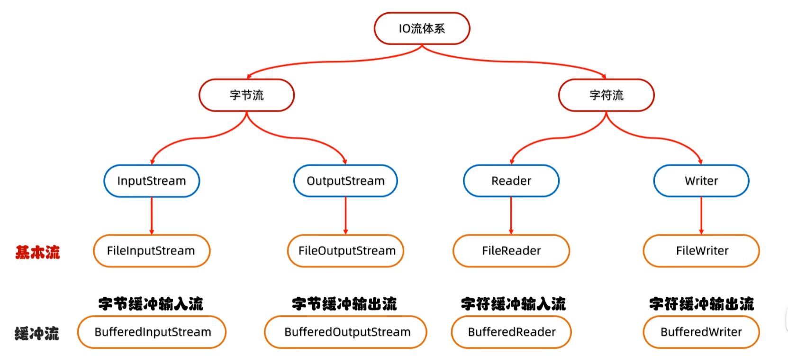
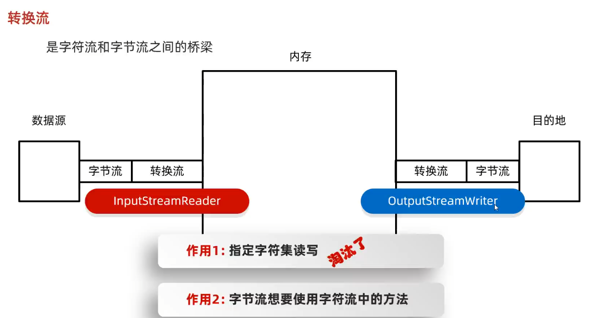

# IO流

java中File类能够对文件本身进行各种操作（获取文件信息、创建、删除等），但是不能进行文件的读写，读写需要靠IO流。

java中有许多IO流，首先进行分类：



其中字节流能操作所有类型的文件，字符流只能操作纯文本文件，用记事本打开，能够看得懂的就是纯文本文件





上面四个流都是基本流

## FileInputStream和FileOutputStream

```java
public static void main(String[] args) throws IOException {
    File file=new File("D:\\a我的笔记\\README.md");
    //通过file创建输入流
    try(FileInputStream inputStream=new FileInputStream(file)){
        //读取一个字节
        System.out.println(inputStream.read());
    }
    //直接通过路径创建输出流
    try (FileOutputStream outputStream=new FileOutputStream("D:\\a我的笔记\\README.md")){
        //写入一个字节
        outputStream.write(98);
    }
}
```

参数可以是路径或者File对象，try中创建的流会自动close以释放资源。try中创建的流必须实现AutoCloseable接口才能自动关闭资源。



```
//直接通过路径创建输出流
try (FileOutputStream outputStream=new FileOutputStream("src\\main\\resources\\a.txt",true)){
    String str="\n111111111";
    byte[] bytes = str.getBytes();
    outputStream.write(bytes);
}
```

通过true可以开启续写，再次写入不会清空之前的内容。


一次读取多个字节，fis为FileInputStream的实例



## FileReader和FileWriter

这两个类用于字符的读取，在读取中文时，会自动识别，一次读取多个字节。

```java
public static void main(String[] args) throws IOException {
        File file=new File("D:\\Demo\\JavaSE\\src\\main\\resources\\a.txt");
        FileReader inputStream=new FileReader(file);
        char[] a = new char[2];
        try(inputStream){
            int len;
            while ((len=inputStream.read(a))!=-1){
                for (int i = 0; i < len; i++) {
                    System.out.print(a[i]);
                }
//                System.out.println();
            }
        }
        FileWriter writer=new FileWriter(file,true);
        try(writer){
            writer.write(new String("文"));
        }
    }
```



## 通过字节流复制文件夹

```java
private static void copyFile(File src, File dest) throws IOException {
    if(!dest.exists()){
        dest.mkdir();
        System.out.println("创建了"+dest.getAbsolutePath()+"目录");
    }
    File[] files=src.listFiles();
    for (File file : files) {
        //如果是文件，复制
        if (file.isFile()){
            FileInputStream inputStream=new FileInputStream(file);
            //创建一个dest前缀+file名称的文件
            FileOutputStream outputStream=new FileOutputStream(new File(dest,file.getName()));
            try(inputStream;outputStream){
                byte[] bytes=new byte[1024*1024];
                int len;
                while ((len=inputStream.read(bytes))!=-1){
                    outputStream.write(bytes,0,len);
                }
                System.out.println("复制了"+file.getAbsolutePath()+"文件");
            }
        }else {
            //如果是目录，递归
            copyFile(file,new File(dest,file.getName()));
        }
    }
}
```

# 缓冲流



**BufferedInputStream**和**BufferedOutputStream**的缓冲区默认大小为8192字节。

```java
public static void main(String[] args) throws IOException {
    BufferedInputStream inputStream = new BufferedInputStream(new FileInputStream("src/main/resources/a.txt"));
    BufferedOutputStream outputStream = new BufferedOutputStream(new FileOutputStream("src/main/resources/b.txt"));
    int a;
    try(inputStream;outputStream){
        while ((a=inputStream.read())!=-1){
            outputStream.write(a);
        }
    }
}
```

在创建这两个缓冲流的时候可以看到，传入的参数是它们对应的基本流

BufferedReader和BufferedWriter的缓冲区默认是8192长度char数组，它里面添加了两个特有的方法。

```java
public static void main(String[] args) throws IOException {
    BufferedReader bufferedReader=new BufferedReader(new FileReader("src/main/resources/b.txt"));
    BufferedWriter bufferedWriter=new BufferedWriter(new FileWriter("src/main/resources/a.txt"));

    try(bufferedReader;bufferedWriter){
        //readLine()方法自动读取一行，不读取换行符。
        System.out.println(bufferedReader.readLine());
        bufferedWriter.write("newLine方法自动根据系统添加换行符");
        bufferedWriter.newLine();
        bufferedWriter.write("newLine方法自动根据系统添加换行符");
    }
}
```

# 转换流

转换流是字符流和字节流之间的桥梁

InputStreamReader、OutputStreamWriter



已过时：

```java
public static void main(String[] args) throws IOException {
    //创建转换流来读取utf8编码的字符
    InputStreamReader inputStreamReader =
            new InputStreamReader(new FileInputStream("src/main/resources/a.txt"), "utf8");
    int ch;
    while ((ch = inputStreamReader.read()) != -1) {
        System.out.print((char) ch);
    }
    inputStreamReader.close();
}
```

JDK11后的新方式：这里的FileReader就是文章前面讲过的基本流-字符输入流

```java
public static void main(String[] args) throws IOException {
    FileReader fileReader=new FileReader("src/main/resources/a.txt", Charset.forName("utf8"));
    int ch;
    while ((ch=fileReader.read())!=-1){
        System.out.print((char) ch);
    }
    fileReader.close();
}
```

# 序列化流

ObjectOutputStream：序列化流，将java对象序列化后写到文件中

ObjectInputStream：反序列化流，将文件中序列化的对象读取出来

两个流是高级流，包装了基本的字节流

```java
public static void main(String[] args) throws IOException, ClassNotFoundException {
    //Pig类需要实现Serializable接口
    Pig pig = new Pig("卢焯", 7);
    ObjectOutputStream objectOutputStream = new ObjectOutputStream(new FileOutputStream("src/main/resources/a.txt"));
    objectOutputStream.writeObject(pig);
    objectOutputStream.close();
    //从文件读取对象
    ObjectInputStream objectInputStream=new ObjectInputStream(new FileInputStream("src/main/resources/a.txt"));
    Pig pig1 = (Pig) objectInputStream.readObject();
    objectInputStream.close();
    System.out.println(pig1);
}
```

被序列化的bean，可以定义一个变量`private static  final long serialVersionUID=1L;`

指定序列化ID，如果ID不一样，序列化会失败。每次修改bean，如果不定义固定的UID，那么每次修改都会改变UID，导致序列化失败。

```java
private static  final long serialVersionUID=1L;
String name;
int age;
transient int  count;//加上transient就不会把这个变量序列化了
```

```java
/从文件读取对象
ObjectInputStream objectInputStream = new ObjectInputStream(new FileInputStream("src/main/resources/a.txt"));
ArrayList<Pig> list = new ArrayList<>();

try {
    while (true) {
        Pig pig = (Pig) objectInputStream.readObject();
        list.add(pig);
    }
} catch (EOFException e) {
    // 到达文件末尾，停止读取
}

for (Pig pig : list) {
    System.out.println(pig);
}

objectInputStream.close();
```

# 压缩流

ZipInputStream：解压缩流

用法：

```java
public static void unZip(String zipFilePath, String destDirectory) throws IOException {
    File destDir = new File(destDirectory);
    //目的文件夹不存在，创建
    if (!destDir.exists()) {
        destDir.mkdir();
    }
    //创建zip输入流
    ZipInputStream zipIn = new ZipInputStream(new FileInputStream(zipFilePath), Charset.forName("GBK"));
    System.out.println(zipIn.toString());
    ZipEntry entry = zipIn.getNextEntry();

    while (entry != null) {
        String filePath = destDirectory + File.separator + entry.getName();
        if (!entry.isDirectory()) {
            extractFile(zipIn, filePath);
        } else {
            File dir = new File(filePath);
            dir.mkdir();
        }
        zipIn.closeEntry();
        entry = zipIn.getNextEntry();
    }
    zipIn.close();
}

//将一个文件输出到指定路径
private static void extractFile(ZipInputStream zipIn, String filePath) throws IOException {
    BufferedOutputStream bos = new BufferedOutputStream(new FileOutputStream(filePath));
    byte[] bytesIn = new byte[4096];
    int read;
    while ((read = zipIn.read(bytesIn)) != -1) {
        bos.write(bytesIn, 0, read);
    }
    bos.close();
}
```

ZipOutputStream：压缩流

用法：

```java
public static void compressToZip(String sourceFilePath, String zipFilePath) {
    try {
        File sourceFile = new File(sourceFilePath);
        FileOutputStream fos = new FileOutputStream(zipFilePath);
        ZipOutputStream zos = new ZipOutputStream(fos);

        if (sourceFile.isDirectory()) {
            //如果是文件夹，递归调用zipDirectory，第二个参数传入文件夹的名字，注意这个文件夹就是要压缩的根目录了
            zipDirectory(sourceFile, sourceFile.getName(), zos);
        } else {
            //如果是单个文件，直接调用zipFile
            zipFile(sourceFile, sourceFile.getName(), zos);
        }

        zos.close();
        fos.close();
    } catch (IOException e) {
        e.printStackTrace();
    }
}

private static void zipDirectory(File directory, String parentPath, ZipOutputStream zos) throws IOException {
    File[] fileList = directory.listFiles();
    if (fileList != null) {
        for (File file : fileList) {
            if (file.isDirectory()) {
                //如果是文件夹，递归调用zipDirectory，但是第二个参数就需要传入parentPath加上当前文件夹的名字
                //这个第二个参数就是从要压缩的根目录到当前目录的路径
                zipDirectory(file, parentPath + "/" + file.getName(), zos);
            } else {
                zipFile(file, parentPath + "/" + file.getName(), zos);
            }
        }
    }
}

private static void zipFile(File file, String entryName, ZipOutputStream zos) throws IOException {
    FileInputStream fis = new FileInputStream(file);
    //根据entryName创建ZipEntry，会自动递归创建文件夹 及 文件夹中的文件。
    ZipEntry zipEntry = new ZipEntry(entryName);
    zos.putNextEntry(zipEntry);

    byte[] buffer = new byte[1024];
    int length;
    while ((length = fis.read(buffer)) > 0) {
        zos.write(buffer, 0, length);
    }

    zos.closeEntry();
    fis.close();
}
```

