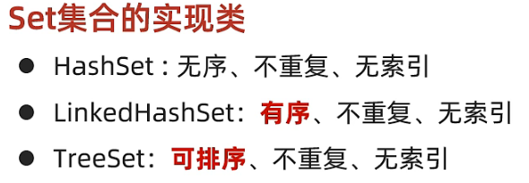
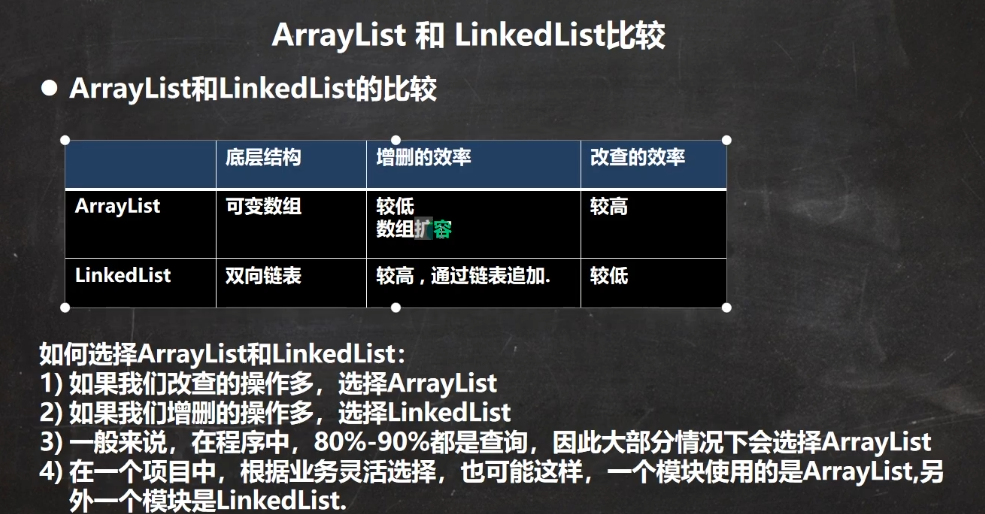
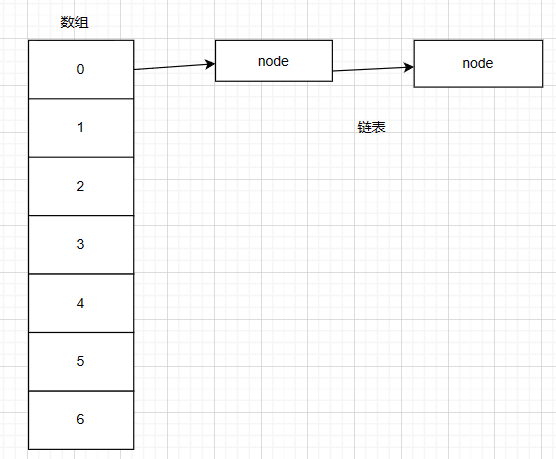
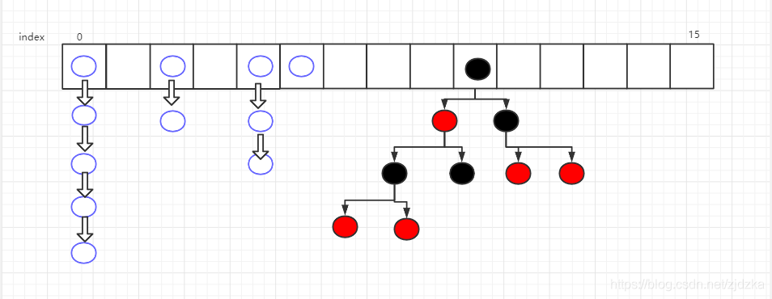
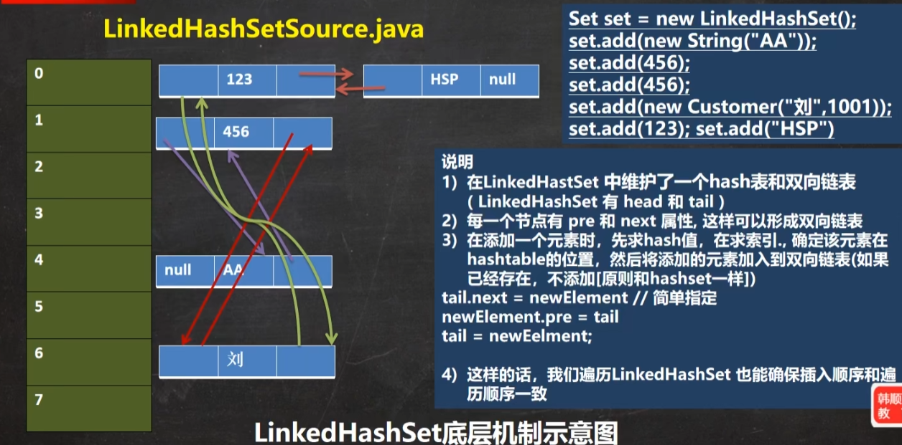

# 1.Collection

集合主要有两类，包括**单列集合**、**双列集合**。

Collection接口有两个重要的子接口：List、Set。它们实现的都是单列集合

Collection实现子类可以存放多个元素，每个元素可以是Object，Collection接口没有直接实现的子类，是通过它的子接口List和Set来实现的。

Collection接口遍历元素：

- 方式一：使用迭代器，通过iterator()方法获取迭代器，所有实现了Collection接口的类都有这个方法。

    ```java
    public static void main(String[] args) {
        List<Integer> list=new ArrayList<>();
        list.add(4);
        list.add(2);
        list.add(3);
        list.add(4);
        Iterator<Integer> iterator = list.iterator();
        while (iterator.hasNext()){
            System.out.println(iterator.next());
        }
    }
    ```
    
- 方式二：增强for循环，它底层实际上也是迭代器

    ```java
    public static void main(String[] args) {
        List<Integer> list=new ArrayList<>();
        list.add(4);
        list.add(2);
        list.add(3);
        list.add(4);
        for (Integer integer : list) {
            System.out.println(integer);
        }
    }
    ```

- 方式三：普通for循环

    ```java
    public static void main(String[] args) {
        List<String> list=new ArrayList<>();
        list.add("xue");
        list.add("ya");
        list.add("666");
        list.add("sho");
        for (int i = 0; i < list.size(); i++) {
            System.out.println(list.get(i));
        }
    }
    ```

# 2.迭代器

ArrayList的迭代器：JDK17

```java
public Iterator<E> iterator() {
    return new Itr();
}
```

```java
private class Itr implements Iterator<E> {
    int cursor;       // index of next element to return //记录下一个未被遍历的index
    int lastRet = -1; // index of last element returned; -1 if no such 记录上一个已被遍历的index
    int expectedModCount = modCount;//记录获取迭代器时集合修改的次数

    // prevent creating a synthetic constructor
    Itr() {}

    public boolean hasNext() {
        return cursor != size;
    }

    @SuppressWarnings("unchecked")
    public E next() {
        checkForComodification();
        int i = cursor;//记录当前index
        if (i >= size)//超出index范围
            throw new NoSuchElementException();
        Object[] elementData = ArrayList.this.elementData;
        if (i >= elementData.length)
            throw new ConcurrentModificationException();
        cursor = i + 1;//索引下移
        return (E) elementData[lastRet = i];
    }

    public void remove() {
        if (lastRet < 0)
            throw new IllegalStateException();
        checkForComodification();

        try {
            ArrayList.this.remove(lastRet);
            cursor = lastRet;
            lastRet = -1;
            expectedModCount = modCount;
        } catch (IndexOutOfBoundsException ex) {
            throw new ConcurrentModificationException();
        }
    }

    @Override
    public void forEachRemaining(Consumer<? super E> action) {
        Objects.requireNonNull(action);
        final int size = ArrayList.this.size;
        int i = cursor;
        if (i < size) {
            final Object[] es = elementData;
            if (i >= es.length)
                throw new ConcurrentModificationException();
            for (; i < size && modCount == expectedModCount; i++)
                action.accept(elementAt(es, i));
            // update once at end to reduce heap write traffic
            cursor = i;
            lastRet = i - 1;
            checkForComodification();
        }
    }

    //检查在获取迭代器后，数组有没有因为并发修改而变化
    final void checkForComodification() {
        if (modCount != expectedModCount)
            throw new ConcurrentModificationException();
    }
}
```

为避免并发修改异常，在使用迭代器遍历的时候，不要使用集合类的方法修改集合

# 3.List、Set

实现List接口的集合类有以下特点：

- 元素存放是有序的，元素可重复，添加顺序和取出顺序一致
- 元素有其对应的索引，可以通过索引直接去出其中的元素
-  List 和数组类似，可以动态增长，根据实际存储的数据的长度自动增长 List 的长度。查找元素效率高，插入删除效率低，因为会引起其他元素位置改变 **<实现类有ArrayList，LinkedList，Vector>**
- List可以放null

实现Set接口的集合类有以下特点：

- 存放的元素是无序的，不重复的数据
- 查找元素效率低下，删除和插入效率高，插入和删除不会引起元素位置改变 **<实现类有HashSet,TreeSet>**
- Set可以存放null



## 3.1 ArrayList

ArrayList是使用数组来存储的，但是它不是线程安全的，在多线程情况下不建议使用。

ArrayList会把元素存放在`transient Object[] elementData;`中

ArrayList如果初始化不指定容量，容量设置为0，后面第一次添加，容量设置为10，后面再次扩容会扩容1.5倍

ArrayList如果初始化指定容量，后面每次扩容，都扩容1.5倍

如果一次添加多个，1.5倍不够，会以实际需要的容量去扩容数组。

**ArrayList的最大容量为2\^31-8，因为ArrayList是使用数组来存放元素的，而数组又使用int来当下标，再加上预留一部分空间来存放其他数据，所以是2\^31-8而不是2\^31-1**

ArrayList部分源码：jdk17

```java
public class ArrayList<E> extends AbstractList<E> implements List<E>, RandomAccess, Cloneable, Serializable {
    private static final long serialVersionUID = 8683452581122892189L;
    private static final int DEFAULT_CAPACITY = 10;
    private static final Object[] EMPTY_ELEMENTDATA = new Object[0];
    private static final Object[] DEFAULTCAPACITY_EMPTY_ELEMENTDATA = new Object[0];
    transient Object[] elementData;
    private int size;

    //一个参数的构造器，会根据参数初始化ArrayList的elementData的长度，后面需要扩容时直接为1.5倍
    public ArrayList(int initialCapacity) {
        if (initialCapacity > 0) {
            this.elementData = new Object[initialCapacity];
        } else {
            if (initialCapacity != 0) {
                throw new IllegalArgumentException("Illegal Capacity: " + initialCapacity);
            }

            this.elementData = EMPTY_ELEMENTDATA;
        }

    }

    //无参构造，它会把elementData的容量设置为0
    //然后第一次添加，会把容量设置为10，后边每次扩容都为1.5倍
    public ArrayList() {
        //注意这个DEFAULTCAPACITY_EMPTY_ELEMENTDATA，这个用来标记ArrayList初始化的时候没有设置参数 与 初始化的时候设置了参数为0的情况划分
        this.elementData = DEFAULTCAPACITY_EMPTY_ELEMENTDATA;
    }

    public ArrayList(Collection<? extends E> c) {
        Object[] a = c.toArray();
        if ((this.size = a.length) != 0) {
            if (c.getClass() == ArrayList.class) {
                this.elementData = a;
            } else {
                this.elementData = Arrays.copyOf(a, this.size, Object[].class);
            }
        } else {
            this.elementData = EMPTY_ELEMENTDATA;
        }

    }
}
```

ArrayList扩容部分的源码：jdk17

```java
private void add(E e, Object[] elementData, int s) {
    //在这里判断，如果this.size等于elementData.length，那么说明容量满了，调用this.grow()方法扩容
    if (s == elementData.length) {
        elementData = this.grow();
    }

    elementData[s] = e;
    this.size = s + 1;
}

public boolean add(E e) {
    //modCount记录被修改的次数
    ++this.modCount;
    this.add(e, this.elementData, this.size);
    return true;
}

private Object[] grow(int minCapacity) {
    int oldCapacity = this.elementData.length;
    if (oldCapacity <= 0 && this.elementData == DEFAULTCAPACITY_EMPTY_ELEMENTDATA) {
        //这里是第一次add的时候，elementData为0，就初始化容量为10
        return this.elementData = new Object[Math.max(10, minCapacity)];
    } else {
        //这里把容量进行1.5倍的扩容，newCapacity是获取的新容量，在newLength中会有个容量上限的判断
        int newCapacity = ArraysSupport.newLength(oldCapacity, minCapacity - oldCapacity, oldCapacity >> 1);
        //这里根据新容量扩容，并把原来的数组复制一份过来给新扩容的数组。
        return this.elementData = Arrays.copyOf(this.elementData, newCapacity);
    }
}

private Object[] grow() {
    return this.grow(this.size + 1);
}

//newLength判断上限不超2147483639，即21亿多，2的31次方
public static int newLength(int oldLength, int minGrowth, int prefGrowth) {
    //这里max比较minGrowth和1.5倍的prefGrowth，如果1.5倍不够用，就增长到刚好适合的容量
    int prefLength = oldLength + Math.max(minGrowth, prefGrowth);
    return 0 < prefLength && prefLength <= 2147483639 ? prefLength : hugeLength(oldLength, minGrowth);
}
```

## 3.2 Vector

Vector和ArrayList类似，只不过他是线程安全的，因为他每个方法都带上了`synchronized`，不过它的效率没有ArrayList高

它的默认初始容量为10，后面每次扩容，都扩容2倍的大小，同时它可以在构造函数中指定每次扩容的大小

`public class Vector<E> extends AbstractList<E> implements List<E>, RandomAccess, Cloneable, Serializable`

部分源码：JDK17

```java
//capacityIncrement用于指定每次扩容的大小
public Vector(int initialCapacity, int capacityIncrement) {
    if (initialCapacity < 0) {
        throw new IllegalArgumentException("Illegal Capacity: " + initialCapacity);
    } else {
        this.elementData = new Object[initialCapacity];
        this.capacityIncrement = capacityIncrement;
    }
}

public Vector(int initialCapacity) {
    this(initialCapacity, 0);
}

public Vector() {
    this(10);
}
```

## 3.3 LinkedList

LinkedList实现了双向链表和双端队列特点

LinkedList线程不安全，没有实现同步

它添加元素使用尾插法

`public class LinkedList<E> extends AbstractSequentialList<E> implements List<E>, Deque<E>, Cloneable, Serializable`

LinkedList的构造方法：JDK17

```java
public LinkedList() {
    this.size = 0;
}

public LinkedList(Collection<? extends E> c) {
    this();
    this.addAll(c);
}
```

LinkedList添加元素的源码：JDK17

```java
public boolean add(E e) {
    this.linkLast(e);
    return true;
}

void linkLast(E e) {
    //获取最后一个节点
    Node<E> l = this.last;
    //创建一个新的节点，这里通过第一个参数指定这个节点的prev，表示该节点的前一个节点
    Node<E> newNode = new Node(l, e, (Node)null);
    this.last = newNode;
    if (l == null) {
        //这里判断添加进来的第一个节点，如果刚刚好是第一个节点，用first指向这个节点
        this.first = newNode;
    } else {
        //如果不是第一个添加进来的节点，那么需要为前一个节点指定它的next。
        l.next = newNode;
    }

    ++this.size;
    ++this.modCount;
}

private static class Node<E> {
    E item;
    Node<E> next;//表示节点的下一个节点
    Node<E> prev;//表示节点的前一个节点

    Node(Node<E> prev, E element, Node<E> next) {
        this.item = element;
        this.next = next;
        this.prev = prev;
    }
}
```

remove方法：

- `public E remove()`：删除第一个元素

    remove最终调用unlinkFirst方法删除第一个元素

    ```java
    private E unlinkFirst(Node<E> f) {
        E element = f.item;
        Node<E> next = f.next;
        f.item = null;
        f.next = null;
        this.first = next;
        //如果没有后继节点了，把last设为null，否者把next节点的prev置为null
        if (next == null) {
            this.last = null;
        } else {
            next.prev = null;
        }
    
        --this.size;
        ++this.modCount;
        return element;
    }
    ```

- ` public E remove(int index)`：删除指定下标

    ```java
    public E remove(int index) {
        this.checkElementIndex(index);
        return this.unlink(this.node(index));
    }
    //本函数获取指定下标的node
    Node<E> node(int index) {
        Node x;
        int i;
        //这里进行判断index是否小于size的一半，如果小于，则从first开始遍历，否则从last开始遍历到index
        if (index < this.size >> 1) {
            x = this.first;
    
            for(i = 0; i < index; ++i) {
                x = x.next;
            }
    
            return x;
        } else {
            x = this.last;
    
            for(i = this.size - 1; i > index; --i) {
                x = x.prev;
            }
    
            return x;
        }
    }
    //本函数负责把一个node节点删除
    E unlink(Node<E> x) {
        E element = x.item;
        Node<E> next = x.next;
        Node<E> prev = x.prev;
        if (prev == null) {
            this.first = next;
        } else {
            prev.next = next;
            x.prev = null;
        }
    
        if (next == null) {
            this.last = prev;
        } else {
            next.prev = prev;
            x.next = null;
        }
    
        x.item = null;
        --this.size;
        ++this.modCount;
        return element;
    }
    ```

- `public boolean remove(Object o)`：删除指定对象



## 3.4 HashSet

HashSet实现了Set接口，注意这个接口的实现类不能通过索引获取元素，也就是说不能通过普通for循环遍历。

HashSet存放的元素的顺序和插入的顺序不一样，但是它内部有自己的排序方法，每次取出的顺序是一样的。

**就是说放进去的顺序和取出来的顺序不一定是一样的**

关于Set添加的问题：

```java
public static void main(String[] args) {
    Set<Dog> set=new HashSet<>();
    System.out.println(set.add(new Dog("tom")));//true
    System.out.println(set.add(new Dog("tom")));//true

    Set<String> set1=new HashSet<>();
    System.out.println(set1.add(new String("tom")));//true
    System.out.println(set1.add(new String("tom")));//false
}
static class Dog{
    String name;

    public Dog(String name) {
        this.name = name;
    }
}
```

HashSet底层是HashMap，HashMap底层是数组+链表+红黑树



在JDK8中，如果一条链的元素到达8，并且table的元素size大小大于等于64，就进行树化（红黑树）



HashMap添加元素的流程：

- 计算元素的hash值

- 对hash求余，得到数组的index

- 如果数组为空，先扩容成默认初始容量16，默认负载因子0.75，后继数组size超过16*0.75的大小，再次扩容

- 找到table[index]这个元素，判断：

    1. hash和key是否和新元素的同样

    2. 调用新元素的equals方法比较旧元素的key

    上面两个条件，只要一个满足，就说明新旧元素一样，需要继续对比这条链表的其他元素

- 如果table[index]这个元素是红黑树，调用红黑树的插入方法`putTreeVal`

- 对比链表的其他元素是否一样，一样则不添加，如果链表中元素都不一样，用尾插法添加。

- 添加完后判断链表长度如果大于等于8，就调用`treeifyBin`方法

- `treeifyBin`方法判断table的元素size等于64，进行红黑树化。否则对数组进行扩容。

**注意判断元素是否一样是根据元素的euqals方法的**

部分源码：JDK17

```java
//add方法
public boolean add(E e) {
    //调用了HashMap的put方法
    //这个PRESENT：private static final Object PRESENT = new Object();
    //PRESENT起到一个占位的作用
    return this.map.put(e, PRESENT) == null;
}
```

HashMap中添加元素的方法：

```java
public V put(K key, V value) {
    return this.putVal(hash(key), key, value, false, true);
}

final V putVal(int hash, K key, V value, boolean onlyIfAbsent, boolean evict) {
    Node[] tab;
    int n;
    //如果一开始数组是空的，会使用resize方法去扩容数组
    if ((tab = this.table) == null || (n = tab.length) == 0) {
        n = (tab = this.resize()).length;
    }

    Object p;
    int i;
    //这里如果经过上面的if语句，tab指向了resize后的数组this.table
    //这里因为是2的整数次方，可以利用(n - 1 & hash)操作求余，来获取index
    if ((p = tab[i = n - 1 & hash]) == null) {
        //这里把节点放入table[i]中
        tab[i] = this.newNode(hash, key, value, (Node)null);
    } else {
        Object e;
        Object k;
        //p指向了数组原来的元素
        //这里if判断旧元素的hash值与key是否等于新元素的hash与key  || 或者key不等于空且两个元素一样
        //先运算&&再运算||
        if (((Node)p).hash == hash && ((k = ((Node)p).key) == key || key != null && key.equals(k))) {
            //把旧元素赋值给了e
            e = p;
        } else if (p instanceof TreeNode) {
            //这里判断是红黑树，就调用红黑树的插入方法
            e = ((TreeNode)p).putTreeVal(this, tab, hash, key, value);
        } else {
            //这里就是说元素的hash求余得到的index位置对应的table已经有元素了，但是旧元素与新的元素又不一样，不满足第一个if的判断，又不是红黑树，
            //就需要使用尾插法插入到链表的后面
            int binCount = 0;

            //循环遍历到最后一个节点
            while(true) {
                if ((e = ((Node)p).next) == null) {
                    //尾插法插入节点
                    ((Node)p).next = this.newNode(hash, key, value, (Node)null);
                    //如果链表长度到8了，将链表红黑树化，treeifyBin中还会判断tab.length>=64才会树化，否则会先对table进行扩容
                    if (binCount >= 7) {
                        this.treeifyBin(tab, hash);
                    }
                    break;
                }
				//如果新元素与旧元素是一样的，不插入了
                if (((Node)e).hash == hash && ((k = ((Node)e).key) == key || key != null && key.equals(k))) {
                    break;
                }

                p = e;
                ++binCount;
            }
        }
		//这里判断e不为null，说明新元素在插入的时候，有旧元素是一样的，返回旧元素的value，同时赋值新元素的value给旧元素的value
        //如果新元素的key和旧元素的key一样，它会把新元素的value替换旧的value
        if (e != null) {
            V oldValue = ((Node)e).value;
            if (!onlyIfAbsent || oldValue == null) {
                ((Node)e).value = value;
            }

            this.afterNodeAccess((Node)e);
            return oldValue;
        }
    }
	//添加修改次数，并判断有没有超过负载，超过了就调用resize方法扩容
    ++this.modCount;
    if (++this.size > this.threshold) {
        this.resize();
    }
	//这个方法是空的。它是留给子类去做一些其他操作的
    this.afterNodeInsertion(evict);
    return null;
}

final Node<K, V>[] resize() {
    //用oldTab保存旧的数组table
    Node<K, V>[] oldTab = this.table;
    //oldCap记录旧数组的长度
    int oldCap = oldTab == null ? 0 : oldTab.length;
    int oldThr = this.threshold;
    int newThr = 0;
    int newCap;
    
    if (oldCap > 0) {
        //如果oldCap超过2^30,无法扩容，返回旧的数组
        if (oldCap >= 1073741824) {
            this.threshold = Integer.MAX_VALUE;
            return oldTab;
        }
		//这里把新的数组容量和阈值增加一倍
        if ((newCap = oldCap << 1) < 1073741824 && oldCap >= 16) {
            newThr = oldThr << 1;
        }
    } else if (oldThr > 0) {
        newCap = oldThr;
    } else {
        //这里对应一开始数组是空的情况，直接赋值默认的值
        newCap = 16;
        newThr = 12;
    }

    //这里解决新的阈值为0的情况，设置新的阈值为newCap * this.loadFactor;
    if (newThr == 0) {
        float ft = (float)newCap * this.loadFactor;
        newThr = newCap < 1073741824 && ft < 1.07374182E9F ? (int)ft : Integer.MAX_VALUE;
    }

    //这三行代码创建新的数组，来达到扩容的目的
    this.threshold = newThr;
    Node<K, V>[] newTab = new Node[newCap];
    this.table = newTab;
    //这里负责扩容后数据的迁移
    if (oldTab != null) {
        //遍历旧的table
        for(int j = 0; j < oldCap; ++j) {
            Node e;
            if ((e = oldTab[j]) != null) {
                oldTab[j] = null;
                if (e.next == null) {//如果链表只有一个节点，直接赋值给新的table
                    newTab[e.hash & newCap - 1] = e;
                } else if (e instanceof TreeNode) {//如果这个链表已经树化了，调用split方法进行数据的迁移
                    ((TreeNode)e).split(this, newTab, j, oldCap);
                } else {//如果链表没有树化，但是节点数大于一的情况
                    Node<K, V> loHead = null;//低位链表头尾指针
                    Node<K, V> loTail = null;
                    Node<K, V> hiHead = null;//高位链表头尾指针
                    Node<K, V> hiTail = null;

                    Node next;
                    do {
                        next = e.next;
                        //在这里根据这个if条件把原来的链表进行二分，分出来新的两个链表
                        //它在后面，会把新的两个链表放到新数组的不同下标处。
                        if ((e.hash & oldCap) == 0) {
                            if (loTail ==  null) {
                                loHead = e;
                            } else {
                                loTail.next = e;
                            }

                            loTail = e;
                        } else {
                            if (hiTail == null) {
                                hiHead = e;
                            } else {
                                hiTail.next = e;
                            }

                            hiTail = e;
                        }

                        e = next;
                    } while(next != null);
					//这里把低位链表放到原来的index(j)处
                    if (loTail != null) {
                        loTail.next = null;
                        newTab[j] = loHead;
                    }
					//这里把高位链表放到新数组的j+oldCap这个下标
                    if (hiTail != null) {
                        hiTail.next = null;
                        newTab[j + oldCap] = hiHead;
                    }
                }
            }
        }
    }

    return newTab;
}
```

hash方法：

```java
static final int hash(Object key) {
    int h;
    //这个操作将h的值得高16位和低16位进行异或运算，是为了降低hash冲突
    return key == null ? 0 : (h = key.hashCode()) ^ h >>> 16;
}
```

如果说HashSet想添加一个类，然后类的字段都一样，则判定为相同的元素，无法重复添加，则需要重写类的equals方法和hashCode方法：

```java
public class Test {

    public static void main(String[] args) {
        Set<Person> set=new HashSet<>();
        System.out.println(set.add(new Person("xue", 18)));//true
        System.out.println(set.add(new Person("xue", 18)));//false
    }

    static class Person{
        String name;
        int age;

        public Person(String name, int age) {
            this.name = name;
            this.age = age;
        }

        @Override
        public boolean equals(Object o) {
            if (this == o) return true;
            if (o == null || getClass() != o.getClass()) return false;
            Person person = (Person) o;
            return age == person.age && Objects.equals(name, person.name);
        }

        @Override
        public int hashCode() {
            return Objects.hash(name, age);
        }

        @Override
        public String toString() {
            return "Person{" +
                    "name='" + name + '\'' +
                    ", age=" + age +
                    '}';
        }
    }
}
```

## 3.5 LinkedHashSet

`public class LinkedHashSet<E> extends HashSet<E> implements Set<E>, Cloneable, Serializable`

`LinkedHashSet`的底层是`LinkedHashMap`，而`LinkedHashMap`又继承`HashMap`

它的底层是数组+双向链表



也就是说`LinkedHashSet`是有序的，但是不可以插入重复元素

`LinkedHashSet`在新建节点的时候，会额外处理双向链表的指向

它的底层依旧依靠`HashMap`的`putVal`方法插入节点

但是在新建节点时调用的是LinkedHashMap的方法`newNode`来处理双向链表

```java
HashMap.Node<K, V> newNode(int hash, K key, V value, HashMap.Node<K, V> e) {
    Entry<K, V> p = new Entry(hash, key, value, e);
    this.linkNodeLast(p);
    return p;
}
//在这个方法中处理双向链表节点的before和after指向，同时还更新了head和tail，让它们分别指向双向链表的头和尾。
private void linkNodeLast(Entry<K, V> p) {
    Entry<K, V> last = this.tail;
    this.tail = p;
    if (last == null) {
        this.head = p;
    } else {
        p.before = last;
        last.after = p;
    }
}
```

```
//在LinkedHashMap中，链表中的节点变成了LinkedHashMap.Entry
//它添加了两个指针before和after用来实现双向链表。
//而它的next指针用来维护table数组中相同index下的那一条单向链表
static class Entry<K, V> extends HashMap.Node<K, V> {
    Entry<K, V> before;
    Entry<K, V> after;

    Entry(int hash, K key, V value, HashMap.Node<K, V> next) {
        super(hash, key, value, next);
    }
}
```

## 3.6 TreeSet

`public class TreeSet<E> extends AbstractSet<E> implements NavigableSet<E>, Cloneable, Serializable`

TreeSet想要对元素实现自定义排序，需要在构造函数中自己传入一个比较器（匿名内部类），如果不传入自定义的比较器，就是使用添加的元素默认的比较器进行排序

TreeSet的底层实际是TreeMap，它的底层是基于红黑树的

`private transient NavigableMap<E,Object> m;`，m存放TreeMap

TreeMap 如果使用默认构造函数，要求key是实现了Comparable接口的，并且使用key的compareTo方法比较，如果key没有compareTo方法就会报错

**java类实现Comparable接口实现排序**：

实现一个Person类并实现Comparable接口

```java
public class Person implements Comparable<Person>{
    int age;
    String name;

    @Override
    public String toString() {
        return "Person{" +
                "age=" + age +
                ", name='" + name + '\'' +
                '}';
    }

    public Person(int age, String name) {
        this.age = age;
        this.name = name;
    }

    public int getAge() {
        return age;
    }

    public String getName() {
        return name;
    }

    @Override
    public int compareTo(Person o) {
        //在TreeSet中this表示要添加的元素，o表示红黑树中已经存在的元素
        //返回负数表示添加的元素更小，存左边
        //返回正数表示添加的元素更大，存右边
        //返回0，不存
        return this.getAge() - o.getAge();//根据年龄大小进行排序，但是这样做，如果遇到相同年龄的，TreeSet不会进行插入
    }
}
```

将compareTo方法改写，加上名字的比较，就可以实现插入相同年龄，但是名字不同的人。

```java
@Override
public int compareTo(Person o) {
    int a=this.getAge() - o.getAge();
    if(this.getAge() - o.getAge()!=0) return a;
    return this.getName().compareTo(o.getName());
}
```

**在创建TreeMap的时候传入比较器实现排序**:

```java
public static void main(String[] args) {
    Set<Integer> treeSet=new TreeSet<>(new Comparator<Integer>() {
        @Override
        public int compare(Integer o1, Integer o2) {
            return o2-o1;//实现从大到小排序,o1为添加进来的元素
        }
    });
    treeSet.add(1);
    treeSet.add(7);
    treeSet.add(3);
    treeSet.add(9);

    System.out.println(treeSet);//[9, 7, 3, 1]

}
```

# 4.Map

Map接口的实现类，用于保存键值对(K-V)类型的数据

K、V可以是任何引用类型的数据

**Map中的key不可以重复，value可以重复**，key和value都可以为null

如果新元素的key和旧元素的key一样，但是value不一样，它会把新元素的value替换旧的value

## 4.1 HashMap

`public class HashMap<K, V> extends AbstractMap<K, V> implements Map<K, V>, Cloneable, Serializable`

HashMap的遍历方式

```java
public static void main(String[] args) {
    Map<String,Integer> map=new HashMap<>();
    map.put("a",1);
    map.put("b",1);
    map.put("c",1);
    map.put("d",1);
    System.out.println("entrySet方式");
    for (Map.Entry<String, Integer> entry : map.entrySet()) {
        System.out.println(entry.getKey()+":"+entry.getValue());
    }
    System.out.println("keySets方式");
    for (String s : map.keySet()) {
        System.out.println(s+":"+map.get(s));
    }
    System.out.println("values方式");
    for (Integer value : map.values()) {
        System.out.println(value);
    }
}
```

通常使用entrySet方式较好，只需要访问map一次

HashMap底层是数组+链表+红黑树


在JDK8中，如果一条链的元素到达8，并且table的元素size大小大于等于64，就进行树化（红黑树）


HashMap添加元素的流程：

- 计算元素的hash值

- 对hash求余，得到数组的index

- 如果数组为空，先扩容成默认初始容量16，默认负载因子0.75，后继数组size超过16*0.75的大小，再次扩容

- 找到table[index]这个元素，判断：

    1. hash和key是否和新元素的同样

    2. 调用新元素的equals方法比较旧元素的key

    上面两个条件，只要一个满足，就说明新旧元素一样，需要继续对比这条链表的其他元素

- 如果table[index]这个元素是红黑树，调用红黑树的插入方法`putTreeVal`

- 对比链表的其他元素是否一样，一样则不添加，如果链表中元素都不一样，用尾插法添加。

- 添加完后判断链表长度如果大于等于8，就调用`treeifyBin`方法

- `treeifyBin`方法判断table的元素size等于64，进行红黑树化。否则对数组进行扩容。

- 如果红黑树的节点数因为被删除，回到了6这个阈值，那么它会再次把红黑树转换回链表。

**注意判断元素是否一样是根据元素的euqals方法的**

在JDK8以前，HashMap底层是数组+链表，并且链表使用头插法，但是JDK8以后，是使用尾插法

部分源码：JDK17

HashMap中添加元素的方法：

```java
public V put(K key, V value) {
    return this.putVal(hash(key), key, value, false, true);
}

final V putVal(int hash, K key, V value, boolean onlyIfAbsent, boolean evict) {
    Node[] tab;
    int n;
    //如果一开始数组是空的，会使用resize方法去扩容数组
    if ((tab = this.table) == null || (n = tab.length) == 0) {
        n = (tab = this.resize()).length;
    }

    Object p;
    int i;
    //这里如果经过上面的if语句，tab指向了resize后的数组this.table
    //这里因为是2的整数次方，可以利用(n - 1 & hash)操作求余，来获取index
    if ((p = tab[i = n - 1 & hash]) == null) {
        //这里把节点放入table[i]中
        tab[i] = this.newNode(hash, key, value, (Node)null);
    } else {
        Object e;
        Object k;
        //p指向了数组原来的元素
        //这里if判断旧元素的hash值与key是否等于新元素的hash与key  || 或者key不等于空且两个元素一样
        //先运算&&再运算||
        if (((Node)p).hash == hash && ((k = ((Node)p).key) == key || key != null && key.equals(k))) {
            //把旧元素赋值给了e
            e = p;
        } else if (p instanceof TreeNode) {
            //这里判断是红黑树，就调用红黑树的插入方法
            e = ((TreeNode)p).putTreeVal(this, tab, hash, key, value);
        } else {
            //这里就是说元素的hash求余得到的index位置对应的table已经有元素了，但是旧元素与新的元素又不一样，不满足第一个if的判断，又不是红黑树，
            //就需要使用尾插法插入到链表的后面
            int binCount = 0;

            //循环遍历到最后一个节点
            while(true) {
                if ((e = ((Node)p).next) == null) {
                    //尾插法插入节点
                    ((Node)p).next = this.newNode(hash, key, value, (Node)null);
                    //如果链表长度到8了，将链表红黑树化，treeifyBin中还会判断tab.length>=64才会树化，否则会先对table进行扩容
                    if (binCount >= 7) {
                        this.treeifyBin(tab, hash);
                    }
                    break;
                }
                //如果新元素与旧元素是一样的，不插入了
                if (((Node)e).hash == hash && ((k = ((Node)e).key) == key || key != null && key.equals(k))) {
                    break;
                }

                p = e;
                ++binCount;
            }
        }
        //这里判断e不为null，说明新元素在插入的时候，有旧元素是一样的，返回旧元素的value，同时赋值新元素的value给旧元素的value
        //如果新元素的key和旧元素的key一样，它会把新元素的value替换旧的value
        if (e != null) {
            V oldValue = ((Node)e).value;
            if (!onlyIfAbsent || oldValue == null) {
                ((Node)e).value = value;
            }

            this.afterNodeAccess((Node)e);
            return oldValue;
        }
    }
    //添加修改次数，并判断有没有超过负载，超过了就调用resize方法扩容
    ++this.modCount;
    if (++this.size > this.threshold) {
        this.resize();
    }
	//这个方法是空的。它是留给子类去做一些其他操作的
    this.afterNodeInsertion(evict);
    return null;
}

final Node<K, V>[] resize() {
    //用oldTab保存旧的数组table
    Node<K, V>[] oldTab = this.table;
    //oldCap记录旧数组的长度
    int oldCap = oldTab == null ? 0 : oldTab.length;
    int oldThr = this.threshold;
    int newThr = 0;
    int newCap;
    
    if (oldCap > 0) {
        //如果oldCap超过2^30,无法扩容，返回旧的数组
        if (oldCap >= 1073741824) {
            this.threshold = Integer.MAX_VALUE;
            return oldTab;
        }
        //这里把新的数组容量和阈值增加一倍
        if ((newCap = oldCap << 1) < 1073741824 && oldCap >= 16) {
            newThr = oldThr << 1;
        }
    } else if (oldThr > 0) {
        //这里对应的是在HashMap构造函数指定了初始化大小的情况
        newCap = oldThr;
    } else {
        //这里对应一开始数组是空的、构造函数没有指定初始大小的情况，直接赋值默认的值
        newCap = 16;
        newThr = 12;
    }

    //这里解决新的阈值为0的情况，设置新的阈值为newCap * this.loadFactor;
    if (newThr == 0) {
        float ft = (float)newCap * this.loadFactor;
        newThr = newCap < 1073741824 && ft < 1.07374182E9F ? (int)ft : Integer.MAX_VALUE;
    }

    //这三行代码创建新的数组，来达到扩容的目的
    this.threshold = newThr;
    Node<K, V>[] newTab = new Node[newCap];
    this.table = newTab;
    //这里负责扩容后数据的迁移
    if (oldTab != null) {
        //遍历旧的table
        for(int j = 0; j < oldCap; ++j) {
            Node e;
            if ((e = oldTab[j]) != null) {
                oldTab[j] = null;
                if (e.next == null) {//如果链表只有一个节点，直接赋值给新的table
                    newTab[e.hash & newCap - 1] = e;
                } else if (e instanceof TreeNode) {//如果这个链表已经树化了，调用split方法进行数据的迁移
                    ((TreeNode)e).split(this, newTab, j, oldCap);
                } else {//如果链表没有树化，但是节点数大于一的情况
                    Node<K, V> loHead = null;//低位链表头尾指针
                    Node<K, V> loTail = null;
                    Node<K, V> hiHead = null;//高位链表头尾指针
                    Node<K, V> hiTail = null;

                    Node next;
                    do {
                        next = e.next;
                        //在这里根据这个if条件把原来的链表进行二分，分出来新的两个链表
                        //它在后面，会把新的两个链表放到新数组的不同下标处。
                        if ((e.hash & oldCap) == 0) {
                            if (loTail ==  null) {
                                loHead = e;
                            } else {
                                loTail.next = e;
                            }

                            loTail = e;
                        } else {
                            if (hiTail == null) {
                                hiHead = e;
                            } else {
                                hiTail.next = e;
                            }

                            hiTail = e;
                        }

                        e = next;
                    } while(next != null);
                    //这里把低位链表放到原来的index(j)处
                    if (loTail != null) {
                        loTail.next = null;
                        newTab[j] = loHead;
                    }
                    //这里把高位链表放到新数组的j+oldCap这个下标
                    if (hiTail != null) {
                        hiTail.next = null;
                        newTab[j + oldCap] = hiHead;
                    }
                }
            }
        }
    }

    return newTab;
}
```

## 4.2 Hashtable

`public class Hashtable<K, V> extends Dictionary<K, V> implements Map<K, V>, Cloneable, Serializable`

Hashtable是线程安全的，HashMap是线程不安全的。

**Hashtable存放的键和值都不能为null**

Hashtable的元素存放在一个Entry数组中`private transient Entry<?, ?>[] table;`

Hashtable的默认初始化大小为11，负载因子为0.75

Hashtable每次扩容2倍再加上1

Hashtable的底层是数组+链表

相同键值的数据，新的value会替换旧的value

## 4.3 TreeMap

`public class TreeMap<K,V> extends AbstractMap<K,V> implements NavigableMap<K,V>, Cloneable, java.io.Serializable`

TreeMap想要对元素实现自定义排序，需要在构造函数中自己传入一个比较器（匿名内部类），如果不传入自定义的比较器，就是使用添加的元素默认的比较器进行排序

TreeMap 如果使用默认构造函数，要求key是实现了Comparable接口的，并且使用key的compareTo方法比较，如果key没有实现compareTo方法就会报错

## 4.4 Properties

`public class Properties extends Hashtable<Object, Object>`

Properties通常用来从配置文件中读取数据，它继承于Hashtable。

# 5.如何选择

**单列元素**：

Collection接口下的List、Set

允许重复：

- 增删多：LinkedList
- 改查多：ArrayList

不允许重复：

- 无序：HashSet
- 排序：TreeSet
- 插入和取出顺序一致：LinkedHashSet、

**双列元素**（键值对）：

- 键无序：HashMap
- 键排序：TreeMap
- 键插入和取出顺序一致：LinkedHashMap
- 读取配置文件：Properties

# 6.哈希值

哈希值在java中是根据hashCode方法计算出来的int类型的整数

该方法在Object类中有定义，所有的对象都可以调用，默认使用地址值进行计算

一般情况下我们会重写类的hashCode方法，利用对象内部的属性值进行计算哈希值

对象的哈希值特点：

- 如果不重写hashCode方法，不同地址的对象计算出来的哈希值是不同的
- 如果已经重写hashCode方法，不同的对象，只要其中已经重写到hashCode方法中的属性值一样，计算出来的哈希值是一样的
- 在小部分情况中，两个对象不一样，但是可能计算出来的哈希值也有可能一样（哈希碰撞）

哈希碰撞：

```java
public static void main(String[] args) {
    System.out.println("abc".hashCode());//96354
    System.out.println("acD".hashCode());//96354
}
```

