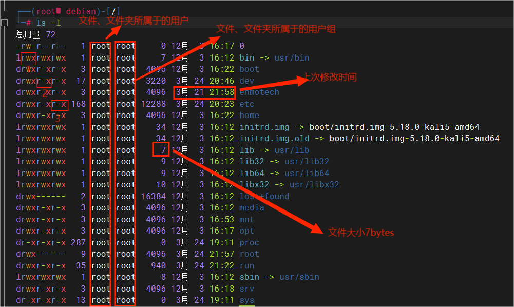

# 1.文件权限




在 Linux 中，上面第二个图 第一个字符代表这个文件是目录、文件或链接文件等等。

- 当为 **d** 则是目录
- 当为 **-** 则是文件；
- 若是 **l** 则表示为链接文档(link file)；
- 若是 **b** 则表示为装置文件里面的可供储存的接口设备(可随机存取装置)；
- 若是 **c** 则表示为装置文件里面的串行端口设备，例如键盘、鼠标(一次性读取装置)。

后面的`rwx` r表示读权限、w表示写权限、x表示执行权限，如果为`-`表示没有这个权限，在图中，三个权限的表示顺序都是读r、写w、执行x。这三个权限的位置不会改变。

r针对文件夹，表示可以查看文件夹内的内容

w针对文件夹，表示可以在文件夹内进行创建、删除、改名等操作

x针对文件表示可以执行这个文件，针对文件夹表示可以更改工作目录到这个文件夹，例如cd到这个目录。

​	

# 2.文件操作

## 2.1查看、跳转

- `ls [选项]... [文件路径]...`用于查看文件路径下的文件与目录，ls默认显示当前工作目录下的所有内容

    选项：

    - `-l`：长数据串列出，包含文件的属性与权限等等数据；(常用) 等同`ll`
    - `-a`：全部的文件，连同隐藏文件( 开头为 . 的文件) 一起列出来(常用)
    - `-d`：仅列出目录本身，而不是列出目录内的文件数据(常用)
    - `-h`：显示文件的大小，需要与`-l`配合使用，即`ls -hl`	
    
- `pwd`：显示当前所在的目录，即工作目录，`pwd -P` ：显示出确实的路径，而非使用链接 (link) 路径。

- `cat 文件路径`：打印出文件的内容到控制台

- `more 文件路径`：和cat类似，不过支持翻页查看。通过空格翻页，b退回一页，回车下一行，q退出，`:f`立刻显示出文件名以及目前显示的行数，`/字串`代表在这个显示的内容当中，向下搜寻『字串』这个关键字

- `head [-n number] 文件`：显示文件的前几行，默认10行，-n 加数字指定显示的行数

- `tail [-n number] 文件`：显示文件的后几行，默认10行，-n 加数字指定显示的行数
    使用`-f `选项追踪文件，能实时查看文件更新

- `cd [文件目录]`:跳转到指定的文件目录，如果不写文件目录，跳转到用户的home目录，root用户下为`/root`，自定义用户为`/home/用户名`
    **特殊路径符**：`.`表示当前目录，`..`表示上一级目录，`~`表示用户home目录```
    
- `which 命令`：查看命令存放的路径

- `find 起始路径 -name 文件名`:查找一个文件，用root用户全盘搜索，文件名加上双引号`"*test"`，使用通配符查找

- `find 起始路径 -size +|- 文件大小`：根据文件大小查找文件，示例：`find / -size +100k`查找大于100k的文件，大小单位有k、M、G。

## 2.2创建、删除

- `mkdir [-mp] 目录名称`：创建新目录

    - `-m`：配置文件的权限
    - `-p`：支持多级目录的创建

    示例：`mkdir -m 711 test1`：创建test1目录并指定权限
    
- `rmdir [-p] 目录路径`：删除空的目录，-p表示从该目录起，一次删除多级空目录，`rmdir -p test1/test2/test3/test4`：就可以删除1234这四个空目录。

- `touch 文件名`：创建一个文件，文件可以带路径，路径需要是已经存在的路径。

- `rm [-r -f -r] 参数...`：一次删除一个或多个文件。路径支持通配符*，\*可以替代任意字符，`rm -rf /*`：删库跑路。

    - -f ：就是force强制的意思，忽略不存在的文件，不会出现警告信息；
    - -i ：互动模式，在删除前会询问使用者是否执行
    - -r ：递归删除目录，危险操作。

## 2.3复制、移动

- `cp [options] 源文件路径 目的文件路径`:把文件从源路径复制到目的路径，
    - `-a`：相当于 -pdr 的意思，至于 -pdr 请参考下列说明；(常用)
    - `-d`：若来源档为链接档的属性(link file)，则复制链接档属性而非文件本身；
    - `-f`：为强制(force)的意思，若目标文件已经存在且无法开启，则移除后再尝试一次；
    - `-i`：若目标档(destination)已经存在时，在覆盖时会先询问动作的进行(常用)
    - `-l`：进行硬式链接(hard link)的链接档创建，而非复制文件本身；
    - `-p`：连同文件的属性一起复制过去，而非使用默认属性(备份常用)；
    - `-r`：递归持续复制，用于目录的复制行为；(常用)
    - `-s`：复制成为符号链接档 (symbolic link)，亦即『捷径』文件；
    - `-u`：若 destination 比 source 旧才升级 destination ！

- `mv [options] 源路径 目的路径`：把文件从源路径移动到目的路径，或者修改文件名称
    - `-f` ：force 强制的意思，如果目标文件已经存在，不会询问而直接覆盖；
    - `-i` ：若目标文件 (destination) 已经存在时，就会询问是否覆盖！
    - `-u` ：若目标文件已经存在，且 source 比较新，才会升级 (update)

## 2.4文件权限修改

- `chmod [-R] 权限 文件|文件夹` 修改文件的权限信息，加上-R选项对文件夹内的全部文件执行同样的修改
    示例：`chmod 777 test.txt` 修改test文件的权限为 rwx rwx rwx，7表示二进制111。此命令只能是root用户或文件所属于的用户修改相应的文件权限。
    
- `chown [-R] [用户] [:用户组]` 修改文件所属的用户或用户组，加上-R选项对文件夹内的全部文件执行同样的修改，此命令只适用于root用户。

    示例：`chown :t1 test.txt` 修改test文件的所属用户组为t1，`chown t1 test.txt` 修改test文件的所属用户为t1


# 3.补充

- `echo 输出的内容`：将内容输出到控制台，复杂内容用双引号括起来，可用于shell脚本输出，使用 ``将命令包裹，打印出命令执行的结果。
- `>`：重定向符，将左侧的结果**覆盖**写到右侧的文件中
- `>>`：重定向符，将左侧的结果追加写到右侧的文件中
- `|`：管道符，将左边命令的结果，作为右边命令的内容源输入
    
- `grep [-n] 关键字 文件路径`:从文件中查找关键字，加上-n选项显示行号
- `wc [-c -m -l -w] 文件路径`:统计文件中的行数、字数等
    - `-c`：统计bytes数量
    - `-m`：统计字符数量
    - `-l`：统计行数
    - `-w`：统计单词数量