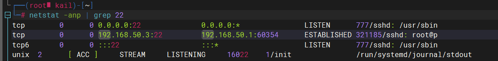

# 1. 静态ip

## 1.1debian系列linux的ip设置

1. `vim /etc/network/interfaces`

2. 文件中添加静态ip设置，network和broadcast一般不用设置。

    ```properties
    auto eth0
    iface eth0 inet static
    address 192.168.1.3
    netmask 255.255.255.0 
    gateway 192.168.1.2 #网关
    # network 192.168.1.0 子网ip
    # broadcast 192.168.1.255 广播地址
    ```

3. 重启`service networking restart`

## 1.2centos的ip设置

如果是centos，要修改的文件是：`/etc/sysconfig/network-scripts/ifcfg-ens33`，有的centos版本默认网卡也改名成eth0了就修改`/etc/sysconfig/network-scripts/ifcfg-eth0`文件，修改后记得重启网络服务。

```properties
DEVICE=ens33
TYPE=Ethernet
ONBOOT=yes
BOOTPROTO=static
NAME="ens33"
IPADDR=192.168.10.102
PREFIX=24
GATEWAY=192.168.10.2
DNS1=192.168.10.2
```

# 2.修改主机名

方法一：

1. `vim /etc/hostname`

2. 在文件中修改主机名
3. 重启

方法二：使用`hostnamectl set-hostname 主机名`命令

使用`hostname`查看主机名

# 3.添加ip与主机的映射

1. `vim /etc/hosts`

2. 格式：`ip 主机名`

    ```
    192.168.10.100 hadoop100
    192.168.10.101 hadoop101
    192.168.10.102 hadoop102
    192.168.10.103 hadoop103
    192.168.10.104 hadoop104
    ```

    添加后就可以直接通过ping 主机名的方式连通其他主机，并且主机的ip修改后只需要修改hosts文件即可，不在需要在代码中一个个修改ip
    
    windows中添加ip与主机映射需要修改文件`C:\Windows\System32\drivers\etc\hosts`,修改后保存副本，然后再用副本替换原来的hosts文件即可

# 4.网络检测及下载
## 4.1 ping

- `ping [-c num] 网址或ip` 检查网址或ip能否ping通，-c指定检查次数，不指定将无限次检查

## 4.2 wget

wget是非交互式的文件下载器，可以在命令行内下载网络文件
- `wget [选项]... [URL]...` 下载文件并保存到工作目录下
选项：
  - `-b` 指定后台下载，并将日志写到工作目录的wget-log文件

  - `-O` 指定下载后保存的文件名 
  `wget -O wordpress.zip http://www.centos.bz/download.php?id=1080`
  将下载的文件保存为.zip文件
  - `-c` 断点续传，大文件下载突然中断可以使用这个选项继续下载    
  - `–user-agent=代理` 伪装user-agent，有些网站能通过根据判断代理名称不是浏览器而拒绝你的下载请求。不过你可以通过–user-agent参数伪装。 
  - `-i` 下载多个文件
  `wget -i filelist.txt` 
  **filelist.txt**：
    
    ```
    url1
    url2
    url3
    ```
  - `-o` 指定下载日志保存在那个文件’

## 4.3 curl
curl支持 HTTP、HTTPS、FTP 等协议，可以用于下载文件、获取信息等
- `curl [选项] url` curl不带任何选项，默认发起get请求
  - `-O` 以 URL 的文件名作为文件名称保存响应内容到当前目录
  `curl -O https://www.example.com/foo/bar.html` 命令将服务器回应保存成文件，文件名为bar.html

  - `-o` 将服务器的回应保存成文件,-o指定文件名
  `curl -o example.html https://www.example.com` 命令将www.example.com保存成example.html
  - `-A` 指定user-agent，curl的默认用户代理字符串是`curl/[version]`
  - `-b` 指定cookie，示例：`curl -b 'foo1=bar;foo2=bar2' https://google.com`,指定了两个cookie

  - `-c` 将响应返回的cookie写到指定的文件，示例：`curl -c cookies.txt https://www.google.com`

  - `-d` 指定post请求的data，使用-d参数以后，HTTP 请求会自动加上标头`Content-Type : application/x-www-form-urlencoded`。并且会自动将请求转为 POST 方法，因此可以省略`-X POST`
  示例：`curl -d 'login=emma' -d 'password=123' -X POST  https://google.com/login`
  
  - `-e` 设置HTTP的标头Referer
  - `-H` 设置 HTTP 的标头Referer
  `curl -H 'Accept-Language: en-US' -H 'Secret-Message: xyzzy' https://google.com` 添加2个请求头

# 5.端口查看
## 5.1 netstat

`netstat [选项] [-A<网络类型>] [--ip]`
选项：
- `-a或--all` 显示所有连线中的Socket。
- `-A<网络类型>或--<网络类型>` 列出该网络类型连线中的相关地址。
- `-c或--continuous` 持续列出网络状态。
- `-C或--cache` 显示路由器配置的快取信息。
- `-e或--extend` 显示网络其他相关信息。
- `-F或--fib` 显示路由缓存。
- `-g或--groups` 显示多重广播功能群组组员名单。
- `-h或--help` 在线帮助。
- `-i或--interfaces` 显示网络界面信息表单。
- `-l或--listening` 显示监控中的服务器的Socket。
- `-M或--masquerade` 显示伪装的网络连线。
- `-n或--numeric` 直接使用IP地址，而不通过域名服务器。
- `-N或--netlink或--symbolic` 显示网络硬件外围设备的符号连接名称。
- `-o或--timers` 显示计时器。
- `-p或--programs` 显示正在使用Socket的程序识别码和程序名称。
- `-r或--route` 显示Routing Table。
- `-s或--statistics` 显示网络工作信息统计表。
- `-t或--tcp` 显示TCP传输协议的连线状况。
- `-u或--udp` 显示UDP传输协议的连线状况。
- `-v或--verbose` 显示指令执行过程。
- `-V或--version` 显示版本信息。
- `-w或--raw` 显示RAW传输协议的连线状况。
- `-x或--unix` 此参数的效果和指定"-A unix"参数相同。
- `--ip或--inet` 此参数的效果和指定"-A inet"参数相同。

如果没有netstat，安装net-tools
`netstat -anp | grep 端口号` 该命令可以查看端口被那些进程占用

图片第一行 0.0.0.0:22 表示端口绑定在0.0.0.0这个ip上，表示允许外部访问，777表示进程号

