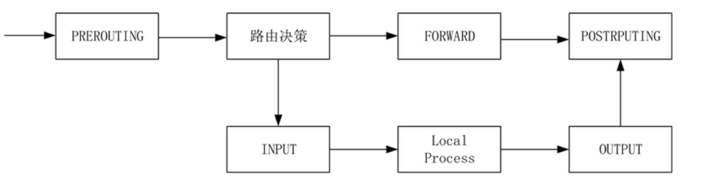
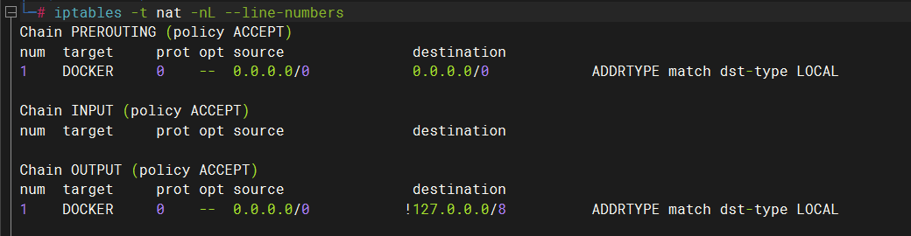

<!--
 * @Descripttion: 
 * @Author: 只会Ctrl CV的菜鸟
 * @version: 
 * @Date: 2023-03-30 21:02:37
 * @LastEditTime: 2023-04-01 20:28:02
-->
# 1.iptables

iptables是被集成在linux内核的防火墙，iptables维护着默认的4表5链。

4表：

- `filter` 控制数据包是否允许进出及转发，可以控制的链路有 INPUT、 OUTPUT、FORWARD
- `nat` 控制数据包中地址转换，可以控制的链路有 INPUT、OUTPUT 、PREROUTING、POSTROUTING
- `mangle` 修改数据包中的原数据，可以控制的链路有 INPUT、OUTPUT、FORWARD 、PREROUTING、POSTROUTING
- `raw` 控制 nat 表中连接追踪机制的启用状况，可以控制的链路有 PREROUTING、OUTPUT

5链：

- `INPUT` 过滤进入的数据
- `OUTPUT` 过滤出去的数据
- `FORWARD` 过滤转发的数据
- `PREROUTING` 路由前过滤
- `POSTROUTING` 路由后过滤

数据流：

防火墙是层层过滤的，按照链中规则的先后顺序进行匹配，如果上一条规则匹配到，并明确指定了通过或者拒绝，则无需继续匹配，如果上一条规则没有明确标识通过或拒绝，则会继续进行匹配。
如果自定义的规则都没匹配到，则匹配默认规则。

# 2.iptables命令

 格式 `iptables [-t table] COMMAND [chain] 匹配条件 -j ACTION`

- `-t`：指定需要维护的防火墙规则表 filter、nat、mangle或raw。在不使用 -t 时则默认使用 filter 表。
- `COMMAND`：子命令，定义对规则的管理。
- `chain`：指明链表。
- `匹配条件`：匹配参数。
- `ACTION`：触发动作。

`COMMAND`：

- `-A chain` 添加防火墙规则，从链的最后面添加
- `-D chain rulenum` 删除防火墙规则
- `-I chain [rulenum]` 插入防火墙规则，默认从链的开头插入，rulenum指定从第条规则的前面插入
- `-F [chain]` 清空防火墙规则，或某个链的规则
- `-L [chain [rulenum]]` 列出防火墙规则，可以指定链
- `-R chain rulenum` 替换防火墙规则
- `-Z [chain [rulenum]]` 清空防火墙数据表的流量统计信息
- `-P chain target` 设置链默认规则，默认ACCEPT
- `-X [chain]` 清除自定义的规则
- `-N` 新建chain

`[chain]`:
- filter
- nat
- mangle
- raw

`匹配条件` ，前面加!表示取反:

- `-p`	匹配协议
- `-s`	匹配源地址
- `-d`	匹配目标地址
- `-i`	匹配入站网卡接口
- `-o`	匹配出站网卡接口
- `--sport` 匹配源端口
- `--dport` 匹配目标端口
- `--src-range` 匹配源地址范围
- `--dst-range` 匹配目标地址范围
- `--limit` 匹配数据表速率
- `--mac-source` 匹配源MAC地址
- `--string` 匹配应用层字串
- `--sports` 匹配源端口
- `--dports` 匹配目标端口

`ACTION`：
- `ACCEPT`	允许数据包通过
- `DROP`	丢弃数据包，客户端无显示
- `REJECT`	拒绝数据包通过，客户端显示403
- `LOG`	将数据包信息记录 syslog 曰志
- `DNAT`	目标地址转换
- `SNAT`	源地址转换
- `MASQUERADE`	地址欺骗，是SNAT的一种特殊形式，适用于动态的、临时会变的ip上。
- `REDIRECT`	重定向
- `RETURN` 表示停止这条链的匹配，到前一个链的规则重新开始。如果到达了一个内建的链(的末端)，或者遇到内建链的规则是 RETURN，包的命运将由链准则指定的目标决定。

# 3.示例

1. `iptables -nvL` 查看filter表的规则
   - `-n` 显示详细的ip和端口
   - `-v` 显示更详细的信息
   - `-L` 以列表显示规则信息
   - `--line-numbers` 加上这个参数按照序号显示列表
2. `iptables -t nat -nL --line-numbers` 查看nat表并显示序号，其中-t用来指定表
  
prot表示协议(protocol), target和上面的`ACTION`差不多意思

3. `iptables -I INPUT -p icmp --icmp-type 8 -j REJECT` 把这条规则插到INPUT链的第一条规则，拒绝ping
4. `iptables -I INPUT -p tcp -s 10.0.0.1 --dport 22 -j REJECT` 拒绝目的端口22，协议tcp，源ip 10.0.0.1的ssh连接
5. `iptables -R INPUT 1 -p tcp -s 10.0.0.1 --dport 22 -j ACCEPT` 修改filter表INPUT链的第一条规则
6. `iptables -D INPUT 1` 删除filter表的INPUT链的第一条规则
7. `iptables -I INPUT 1 -p tcp -m multiport --dport 22,80,8080  -j ACCEPT` 插入filter表INPUT链第一条，开放多个端口：22，80，8080，协议tcp
-m 打开扩展模块的支持
8. `iptables -I INPUT 1 -p tcp -dport 50010:50050 -j ACCEPT` 开放50010到50050的端口
9. 规则一：`iptables -I INPUT -p icmp --icmp-type 8 -m limit --limit 6/min --limit-burst 10 -j ACCEPT`
该规则`--limit 6/min`设置一分钟只能ping 6次，同时`--limit-burst 10`设置从第十个ping开始限制的计数
规则二：`iptables -I INPUT 2 -p icmp --icmp-type 8  -j REJECT`
该规则紧跟上一条规则，当上一条规则ping超过限制，就不匹配了，并没有做出拒绝ping的判定，此规则作出拒绝ping的判定，两规则配合实现在ping超过10次后限制ping的次数为6/min。
