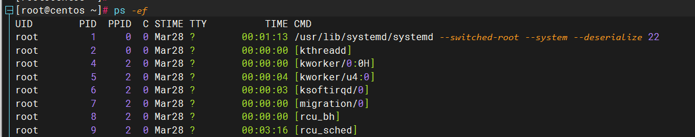
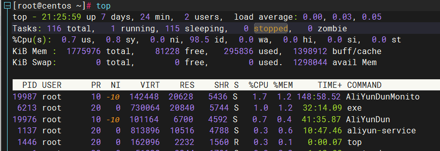
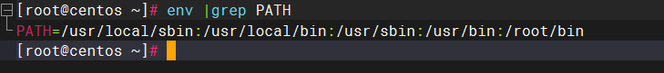
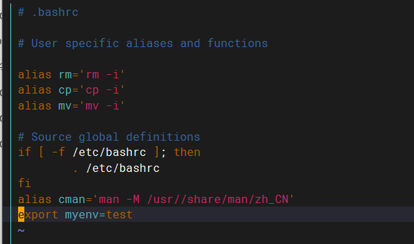

<!--

 * @Descripttion: 
 * @Author: 只会Ctrl CV的菜鸟
 * @version: 
 * @Date: 2023-03-24 20:37:55
 * @LastEditTime: 2023-04-04 21:53:24
-->

linux中进程和服务不同的是，服务指一直在后台运行，为其他应用提供服务，服务也称为守护进程（deamon）。

# 1.systemctl

`systemctl start 服务名` 启动
`systemctl stop 服务名` 停止
`systemctl status 服务名` 查看状态
`systemctl enable 服务名` 开机自启动
`systemctl disable 服务名` 关闭开机自启动

# 2.时间、时区

## 2.1 date

`date [-d] [+格式字符串]` 显示时间，date显示系统默认格式的时间字符串，-d用于日期计算
示例1：`date "+%Y-%m-%d %H:%M:%S"` 以`年-月-日 小时:分钟:秒`显示
结果：`2023-04-04 13:22:07`

示例2：`date -d "+1 day" "+%Y-%m-%d %H:%M:%S"` 日期加一天
结果：`2023-04-05 13:42:07`

- `%Y` 年
- `%y` 年份后两位数字
- `%m` 月份
- `%d` 日
- `%H` 小时
- `%M` 分钟
- `%S` 秒
- `%s` 自1970-01-01 00:00:00 UTC到现在的秒数

## 2.2 修改时区

`rm -f /etc/localtime` 删除默认的本地时区设置
`ln -s /usr/share/zoneinfo/Asia/Shanghai /etc/localtime` 将/etc/localtime链接到上海时区设置的文件，修改成上海的时间

## 2.3 时间校准

通过ntp可以校准时间，不过系统没有自带
通过下面的命令设置时间校准
`yum -y install ntp`
`systemctl start ntpd`
`systemctl enable ntpd`

# 3.查看进程

- `ps [-ef]` 查看进程，可以配合grep过滤
  - `-e` 查看全部进程
  - `- f` 以格式化的方式展示全部信息
  
UID：进程所属的用户的id
PID： 进程id
PPID：进程的父进程的id，父进程启动子进程
C：此进程的cpu占用率
TTY：启动此进程的终端序号，如显示？，表示非终端启动
TIME：进程占用CPU的时间
CMD：进程对应的名称或启动路径或启动命令

# 4.关闭进程

- `kill [-9] 进程id` 使用-9表示强制关闭，不使用-9的话是否关闭看进程自身处理机制

# 5.查看系统状态

- `top [选项]` 查看系统资源占用，类似windows任务管理器
  
    - `-d` 改变显示的更新速度，或是在交互式指令列( interactive command)按 s
    
    - `-q` 没有任何延迟的显示速度，如果使用者是有 superuser 的权限，则 top 将会以最高的优先序执行
    
    - `-c` 切换显示模式，共有两种模式，一是只显示执行档的名称，另一种是显示完整的路径与名称
    
    - `-S` 累积模式，会将己完成或消失的子进程 ( dead child process ) 的 CPU time 累积起来
    
    - `-s` 安全模式，将交谈式指令取消, 避免潜在的危机

    - `-i` 不显示任何闲置 (idle) 或无用 (zombie) 的进程

    - `-n` 更新的次数，完成后将会退出 top

    - `-b` 批次档模式，搭配 "n" 参数一起使用，可以用来将 top 的结果输出到档案内，`top -b -n 3 > /tmp/top.tmp`
    
- `-p` 指定进程号
  
    - `-u` 查找特定用户启动的进程
    
      第一行top后面显示当前时间，up表示系统运行时间，load average表示最近1,5,15分钟的系统负载 
    
      Tasks的zombie表示僵尸进程
    
      %Cpu(s):CPU使用率，us:用户CPU使用率，Sy:系统CPU使用率，ni:高优先级进程占用CPU时间百分比，id:空闲CPU率，wa:IO等待CPU占用率，hi:CPU硬件中
      断率，si:CPU软件中断率，st:强制等待占用CPU率
    
      Kib Mem:物理内存，total:总量，free:空闲，used:使用，buff/cache:buff和cache占用
      KibSwap:虚拟内存（交换空间），total:总量，free:空闲，used:使用
    
      PR：进程优先级，数字越小优先级越高
      NI：负值表示高优先级，正值表示低优先级
      VIRT：进程使用的虚拟内存，单位KB
      RES：进程使用的物理内存
      SHR：进程使用的共享内存
      S:进程状态（S休眠，R运行，Z僵死状态，N负数优先级，I空闲状态）
      %MEN：进程内存占用率
      TIME+：进程使用cpu的时间总计，单位10毫秒
  
- `df [-h]` 查看系统磁盘的占用情况，加上-h更加适合阅读

# 6.环境变量

`env`命令查看系统的环境变量，环境变量是一种key-value的结构

PATH记录了系统执行任何命令的搜索路径，路径之间以 : 隔开，当执行命令，会去PATH中的路径中寻找命令

当知道了环境变量的key，可以通过`$key`取得环境变量的值，`{$key}其他字符`，可以用{}拼接其他字符

`echo $PATH`命令输出当前的`PATH`环境变量的值

## 6.1 设置环境变量

通过命令临时设置：`export key=value`

永久生效：

- 针对当前用户生效：修改`~/.bashrc`文件，添加export命令设置key-value
- 针对所有用户生效：修改`/etc/profile`文件，添加export命令设置key-value

上述两个文件修改后需要通过`source 配置文件`命令来令其生效

上图中为当前用户设置了一个myenv的环境变量。