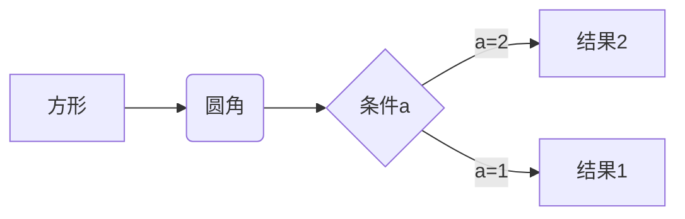

1. 创建notification
2. 使用notification
    1. 二级列表
#一级标题
##二级标题
```python
print("hello world")
def one(a,b)
    return a+b
```
*斜体*
**粗体**
***粗体加斜体***
-----------------------------------
~~删除线,我是删除线~~
这是一行代码`print("hello world")`

您可以使用渲染LaTeX数学表达式 [KaTeX](https://khan.github.io/KaTeX/):

Gamma公式展示 $\Gamma(n) = (n-1)!\quad\forall
n\in\mathbb N$ 是通过欧拉积分

$$
\Gamma(z) = \int_0^\infty t^{z-1}e^{-t}dt\,.
$$
> 6666

	#include &lt;stdio.h&gt;
	int main(void)
	{
	    printf(&#34;Hello world\n&#34;);
	}

超链接：

欢迎阅读 [Lapland Stark](https://blog.csdn.net/weixin_45494811)


我经常去的几个网站[Google][1]、[Leanote][2]。

[1]:http://www.google.com
[2]:http://www.leanote.com

使用 Markdown[^1]可以效率的书写文档, 直接转换成 HTML[^2]。

[^1]:Markdown是一种纯文本标记语言

[^2]:HyperText Markup Language 超文本标记语言




