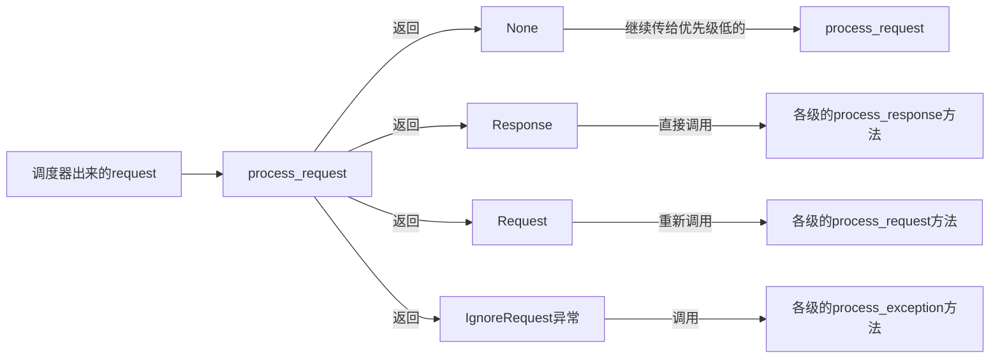
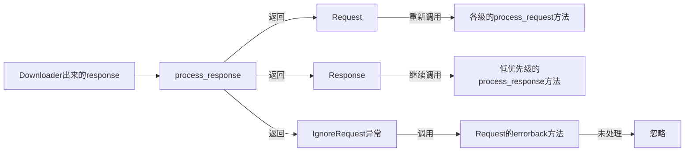
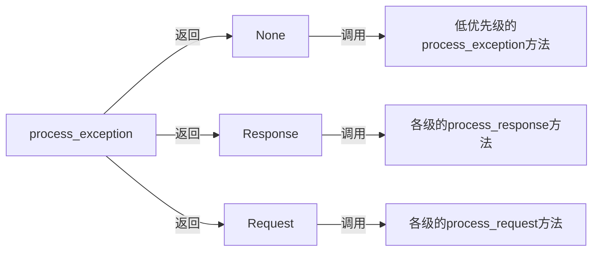

<!--
*@Descripttion:
*@Author:只会CtrlCV的菜鸟
*@version:
*@Date:2023-01-0517:59:56
*@LastEditTime: 2023-02-09 16:21:33
-->

# scrapy基本使用

## 1.新建爬虫项目

终端执行命令：`scrapy start project projectName`
执行后创建名字为projectName的文件夹
里面会有一些文件:

|      文件名      |                 用途                  |
| :--------------: | :-----------------------------------: |
|    `spiders`     |          放置Spiders的文件夹          |
|    `items.py`    |    Items的定义，定义爬取的数据结构    |
| `middlewares.py` | Middlewares的定义，定义爬取时的中间件 |
|  `pipelines.py`  |     Pipelines的定义，定义数据管道     |
|  `settings.py`   |               配置文件                |
|  `projectName`   |       项目的模块需要从这里引入        |
|   `scrapy.cfg`   |        Scrapy部署时的配置文件         |

## 2.创建spider

创建项目后我们还需要创建爬虫才能开始我们的爬取，在文件spiders中存放的就是我们通过命令创建的爬虫。
cd到项目的目录下，通过命令`scrapy genspider test baidu.com`创建一个爬虫
第一个参数是Spider名称，第二个参数是网站域名执行完毕之后，spiders 文件夹中多了一个`test.py`，它就是刚刚创建的Spider。
test.py的内容：

```python
class TestSpider(scrapy.Spider):
    name='test'
    allowed_domains=['baidu.com']
    start_urls=['http://baidu.com/']

    def parse(self,response):
        pass
```
|方法或属性|用途|
|:-:|:-:|
|name|它是每个项目唯一的名字，用来区分不同的Spider|
|alloweddomains|它是允许爬取的域名，如果初始或后续的请求链接不是这个域名下的，则请求链接会被过虑掉|
|start_urls|它包含了Spider在启动时爬取的url列表，初始请求是由它来定义的|
|parse|它是Spider一个方法默认情况下，被调用时start_urls里面的链接构成的请求完成下载执行后，返回的响应就会作为唯一的参数传递给这个函数该方法负责解析返回的响应、提取数据或者进一步生成要处理的请求|

## 3.设置日志级别

在settings.py文件中添加字段：`LOG_LEVEL='ERROR'`可以设置日志只显示错误提示和输出

## 4.运行项目

通过命令`scrapy crawl test`可以运行爬虫，test为爬虫名（name），<fontcolor=bluesize=3>运行前先去settings.py文件把`ROBOTSTXT_OBEY`字段值设置为`False`，否则会爬取失败</font>


## 5.数据解析

### 5.1 方法1
通过`from scrapy import  Selector`,导入Selector,利用Selector的`xpath()`,`css()`,`re()`等方法
在parse方法中进行解析

```python
def parse(self, response):
    with open('res.html', 'w', encoding='utf-8')asf:
        f.write(response.text)
    # 传入response创建selector
    selector = Selector(response)
    for i in selector.xpath('//p/text()')[0].getall():
        print(i)
        pass

```

通过`get()`获取列表第一个元素，`getall()`获取列表所有元素

### 5.2 方法2

直接在response后面调用`xpath()`,`css()`,`re()`等方法
例如：`response.xpath()`,同时response.text等可以获取结果的文本

## 6.UA伪装

在settings.py文件中修改字段`USER_AGENT`进行ua伪装
`USER_AGENT='Mozilla/5.0(WindowsNT10.0;Win64;x64)AppleWebKit/537.36(KHTML,likeGecko)Chrome/106.0.0.0Safari/537.36'`

## 7.持久化存储 1 1 1  

### 7.1基于终端指令

这种方法只能将parse方法的返回值存储到文本文件中，这种方法了解即可，不推荐使用
在运行项目的时候加上`-o`选项
例如：`scrapy crawltest -o test.csv`就会把parse方法返回的列表数据保存到csv文件中，但是这种方法只能保存成已下几种后缀的文件
'json', 'jsonlines', 'jl' , 'csv' , 'xml' , 'marshal', 'pickle'

### 7.2通过管道（ItemPipeline）存储

**ItemPipeline主要功能**

- 清理html数据
- 验证爬取数据，检测爬取字段
- 查重并丢弃重复内容
- 将爬取结果保存到数据库

我们可以在pipelines.py文件中自定义管道类，只需要实现指定的方法，其中必须要实现的一个方法是：`process_item(self,item,spider)`
被定义的管道类会默认调用这个方法对Item进行处理，比如，我们可以进行数据处理或者将数据写入到数据库等操作。它必须返回Item类型的值或者抛出DropItem异常
`process_item()`方法的返回类型归纳如下:

- 如果它返回的是Item对象，那么此Item会被低优先级的ItemPipeline`process_item()`方法处理，直到所有的方法被调用完毕
- 如果它抛州的是DropItem异常，那么此Item会被丢弃，不再进行处理

**管道的其他方法：**

- `open_spider(self,spider)`方法是在Spider开启的时候被自动调用的，在这里我们可以做些初始化操作，如开启数据库连接等，参数spider就是被开启的spider对象。
- `close_spider(self,spider)`方法是在Spider关闭的时候自动调用的,在这里我们可以做些收尾作，如闭数据库连接等，参数spider就是被关闭的Spider对象。
- `from_crawler(cls,crawler)`方法是类方法，用＠classmethod标识，是一种依赖注入的方式它的参数是crawler，通过crawler对象，我们可以拿到Scrapy的所有核心组件，如全局配置的每个信息，然后创建Pipeline参数，cls就是Class，最后返回Class实例

**详细使用示例**
1.在items.py定义item类
假设爬取的信息处理后提取出两个字段name和title，可以这样定义item类，示例：

```python
class ScrapyTestItem(scrapy.Item):
    # define the fields for your item here like:
    # name=scrapy.Field()
    name=scrapy.Field()
    title=scrapy.Field()
    pass
```

2.在parse方法yield数据
先导入item类`from scrapy_test.items import ScrapyTestItem`

```python
def parse(self, response):
    # 省略

    # 将数据封装到item
    item = ScrapyTestItem()
    item['name'] = name
    item['title'] = title
    # yield item给管道
    yield item
```

3.在pipelines.py定义管道并在设置中开启管道
开启管道：

```python
# Configureitempipelines
# Seehttps://docs.scrapy.org/en/latest/topics/item-pipeline.html
ITEM_PIPELINES={
# 300（优先级）数值越小优先级越高
'scrapy_test.pipelines.ScrapyTestPipeline':300,
}
```

管道的定义：

```python
class ScrapyTestPipeline:
    # 这里定义数据库打开，文件打开等操作
    def open_spider(self, spider):
        pass

    # 这里进行数据的存储处理，其中item就是在parse方法中yield的item
    def process_item(self, item, spider):
        return item

    # 进行数据库关闭等操作
    def close_spider(self, spider):
        pass
```

如果需要对数据进行不同的保存操作，可以定义多个管道并设置优先级来确定管道的运行次序。<font color=red size=4>注意在优先级高的管道类的process_item方法中returnitem返回item给下一个管道类，否则优先级低的管道类无法接收到item</font>

## 8.自定义请求方法（get、post等）

在scrapy的spider类中，我们可以自定义请求的方法，来决定请求是get请求还是post请求等其他方法。
在scrapy为我们创建的spider类中（这个类继承自scrapy.Spider），会有start_urls这个列表存放起始的url，然后会在父类默认的方法`start_requests`中对起始url进行get请求。
父类的start_requests方法：

```python
def start_requests(self):
    if not self.start_urls and hasattr(self, 'start_url'):
        raise AttributeError(
            "Crawling could not start: 'start_urls' not found "
            "or empty (but found 'start_url' attribute instead, "
            "did you miss an 's'?)")
    for url in self.start_urls:
        yield Request(url, dont_filter=True)
```


我们可以通过重写父类的start_requests方法来实现特定的请求。
其中有一个scrapy封装好的类Request，他可以通过`from scrapy import Request`导入。
<font color=red size=5>Request的构造参数：</font>

|参数名|用途|
|:-:|:-:|
|url|Request的页面链接,即RequestURL。|
|callback|Request的回调方法，通常这个方法需要定义在Spider类里面，并且需要对应一个response参数，代表Request执行请求后得到的Response对象。如果这个callback参数不指定，默认会使用Spider类里面的parse方法。|
|method|Request的方法，默认是GET，还可以设置为POST、PUT、DELETE等。|
|meta|Request请求携带的额外参数,利用meta，我们可以指定任意处理参数，特定的参数经由Scrapy各个组件的处理,可以得到不同的效果。另外,meta还可以用来向回调方法传递信息。body|
|headers|RequestHeaders，是字典形式。|
|cookies|Request携带的Cookie，可以是字典或列表形式。|
|encoding|Request的编码，默认是utf-8。|
|prority|Request优先级，默认是0，这个优先级是给Scheduler做Request调度使用的，数值越大,就越被优先调度并执行。|
|dont_filter|Request不去重,Scrapy默认会根据Request的信息进行去重，使得在爬取过程中不会出现重复请求，设置为True代表这个Request会被忽略去重操作，默认是False。|
|errback|错误处理方法，如果在请求处理过程中出现了错误，这个方法就会被调用。|
|flags|请求的标志，可以用于记录类似的处理。|
|cb_kwargs|回调方法的额外参数,可以作为字典传递。|

以上便是Request的构造参数，利用这些参数，我们可以灵活地实现Request的构造。

Request由Downloader执行之后，得到的就是Response结果了，它代表的是HTTP请求得到的响应结果，同样地我们可以梳理一下其可用的属性和方法，以便我们做解析处理使用。
<font color=red size=4>Response的参数</font>

|      参数名       |                                                      用途                                                      |
| :---------------: | :------------------------------------------------------------------------------------------------------------: |
|        url        |                                                  RequestURL。                                                  |
|      status       |                                      Response状态码,如果请求成功就是200。                                      |
|      headers      |                                ResponseHeaders，是一个字典，字段是一一对应的。                                 |
|       body        |          ResponseBody,访问页面后得到的源代码结果，比如是HTML或者JSON字符串，但注意其结果是bytes类型。          |
|      request      |                                          Response对应的Request对象。                                           |
|    certificate    |                    是twisted.internet.ssl.Certificate类型的对象，通常代表一个SSL证书对象。                     |
|    ip_address     |               是一个ipaddress.IPv4Address或ipaddress.IPv6Address类型的对象，代表服务器的IP地址。               |
|      urljoin      |               是对URL的一个处理方法，可以传入当前页面的相对URL，该方法处理后返回的就是绝对URL。                |
| follow/follow_all | 是一个根据URL来生成后续Request的方法，和直接构造Request的是，该方法接收的url可以是相对URL，不必一定是绝对URL。 |

另外Response还有几个常用的子类，如TextResponse和HtmlResponse，HtmlResponse
又是TextResponse的子类，实际上回调方法接收的response参数就是一个HtmlResponse对象，它还有几个常用的方法或属性

<font color=red size=5>HtmlResponse的额外参数</font>
|  参数名  |                                                用途                                                |
| :------: | :------------------------------------------------------------------------------------------------: |
|   text   |                                   同body属性，但结果是str类型。                                    |
| encoding |                                   Response的编码，默认是utf-8。                                    |
| selector | 根据Response的内容构造而成的Selector对象，利用它我们可以进一步调用xpath、css等方法进行结果的提取。 |
|  xpath   |                       传入XPath进行内容提取，等同于调用selector的xpath方法。                       |
|   css    |                      传入CSS选择器进行内容提取，等同于调用selector的css方法。                      |
|   json   |                 是Scrapy2.2新增的方法，利用该方法可以直接将text属性转为JSON对象。                  |


## 9.关于下载中间件

Scheduler从队列中拿出一个Request发送给Downloader执行下载，这个过程会经过DownloaderMiddleware的处理。另外，当Downloader将Request下载完成得到Response返回给Spider时会再次经过DownloaderMiddleware处理。

也就是说，DownloaderMiddleware在整个架构中起作用的位置是以下两个。

- 在Scheduler调度出队列的Request发送给Downloader下载之前，也就是我们可以在Request执行下载之前对其进行修改。
- 在下载后生成的Response发送给Spider之前，也就是我们可以在生成Resposne被Spider解析之前对其进行修改。

DownloaderMiddleware的功能十分强大，修改User-Agent、处理重定向、设置代理、失败重试、设置Cookies等功能都需要借助它来实现。下面我们来了解一下DownloaderMiddleware的详细用法。

scrapy系统自带的下载中间件被放在`DOWNLOADER_MIDDLEWARES_BASE`设置中
用户自定义的中间件需要在settings.py文件的`DOWNLOADER_MIDDLEWARES`中进行设置
该设置是一个dict，键是中间件类路径，键值是中间件的顺序，是一个正整数0-1000，越小越靠近引擎。
例:`"scrapy.downloadermiddlewares.robotstxt.RobotsTxtMiddleware":100，`数字越小,优先级越高即越靠近引擎
各中间件含义(通过命令`scrapysettings--get=DOWNLOADER_MIDDLEWARES_BASE`查看)

|                                    中间件                                     |                                 含义                                  |
| :---------------------------------------------------------------------------: | :-------------------------------------------------------------------: |
|       "scrapy.downloadermiddlewares.robotstxt.RobotsTxtMiddleware":100,       |                           机器人协议中间件                            |
|        "scrapy.downloadermiddlewares.httpauth.HttpAuthMiddleware":300,        |                          http身份验证中间件                           |
| "scrapy.downloadermiddlewares.downloadtimeout.DownloadTimeoutMiddleware":350, |                            下载延迟中间件                             |
|  "scrapy.downloadermiddlewares.defaultheaders.DefaultHeadersMiddleware":400,  |                           默认请求头中间件                            |
|       "scrapy.downloadermiddlewares.useragent.UserAgentMiddleware":500,       |                            用户代理中间件                             |
|           "scrapy.downloadermiddlewares.retry.RetryMiddleware":550,           |                            重新尝试中间件                             |
|       "scrapy.downloadermiddlewares.ajaxcrawl.AjaxCrawlMiddleware":560,       |          基于元片段html标签找到“AJAX可抓取”页面变体的中间件           |
|      "scrapy.downloadermiddlewares.redirect.MetaRefreshMiddleware":580,       |                           元数据刷新中间件                            |
| "scrapy.downloadermiddlewares.httpcompression.HttpCompressionMiddleware":590, | HTTP压缩中间件,该中间件允许从网站发送/接收压缩（gzip，deflate）流量。 |
|        "scrapy.downloadermiddlewares.redirect.RedirectMiddleware":600,        |                该中间件根据响应状态处理请求的重定向。                 |
|         "scrapy.downloadermiddlewares.cookies.CookiesMiddleware":700,         |                             cookie中间件                              |
|       "scrapy.downloadermiddlewares.httpproxy.HttpProxyMiddleware":750,       |                             IP代理中间件                              |
|           "scrapy.downloadermiddlewares.stats.DownloaderStats":850,           |            用于存储通过它的所有请求，响应和异常的统计信息             |
|       "scrapy.downloadermiddlewares.httpcache.HttpCacheMiddleware":900        |                              缓存中间件                               |

## 10.下载中间件类中的方法

如果想要使用下载中间件进行一些自定义的操作，需要去middlewares.py文件中进行下载中间件类的自定义。

每个DownloaderMiddleware类都有三个核心方法，只要实现其中一个方法就可以实现自定义下载中间件：


- **`def process_request(self,request,spider)`**:
Request被Engine发送给Downloader之前，process_request方法就会被调用，也就是在Request从Scheduler里被调度出来发送到Downloader下载执行之前，我们都可以用process_request方法对Request进行处理。
这个方法的返回值必须为None、Response对象、Request对象三者之一，或者抛出IgnoreRequest异常。
process_request方法的参数有两个。
`request`:Request对象，即被处理的Request。
`spider`:Spdier对象,即此Request对应的Spider对象。
返回类型不同，产生的效果也不同。下面归纳一下不同的返回情况。
    - 当返回是<font color=red size=3>None</font>时，Scrapy将继续处理该Request，接着执行其他DownloaderMiddleware的process_request方法，一直到Downloader把Request执行得到Response才结束。这个过程其实就是修改Request的过程，不同的DownloaderMiddleware按照设置的优先级顺序依次对Request进行修改，最后送至Downloader执行。
    - 当返回为<font color=gree size=3>Response</font>对象时，更低优先级的DownloaderMiddleware的`process_request`和`process_exception`方法就不会被继续调用，每个DownloaderMiddleware的`process_response`方法转而被依次调用。调用完毕后，直接将Response对象发送给Spider处理。
    - 当返回为<font color=blue size=3>Request</font>对象时，更低优先级的DownloaderMiddleware的process_request方法会停止执行。这个Request会重新放到调度队列里，其实它就是一个全新的Request，等待被调度。如果被Scheduler调度了，那么所有的DownloaderMiddleware的process_request方法会被重新按照顺序执行。
    - 如果抛出`IgnoreRequest`异常，则所有的DownloaderMiddleware的process_exception方法会依次执行。如果没有一个方法处理这个异常，那么Request的errorback方法就会回调。如果该异常还没有被处理,那么它便会被忽略。

- **`def process_response(self,request,response,spider)`**:
Downloader执行Request下载之后，会得到对应的Response。
Engine便会将Response发送给Spider进行解析。在发送给Spider之前，我们都可以用process_response方法来对Response进行处理。process_response方法的返回值必须为Request对象和Response对象两者之一，或者抛出IgnoreRequest异常。
process_response方法的参数有3个。
`request`:Request对象，即此Response对应的Request。response:Response对象，即被处理的Response。
`spider`:Spider对象，即此Response对应的Spider对象。<br>
下面对不同的返回情况做一下归纳。
    - 当返回为<font color=red size=3>Request</font>对象时，更低优先级的DownloaderMiddleware的process_response方法不
会继续调用。该Request对象会重新放到调度队列里等待被调度，相当于一个全新的Request。然后，该Request会被process_request方法顺次处理。
    - 当返回为<font color=gree size=3>Response</font>对象时，更低优先级的Downloader Middleware的process_response方法会继续被调用，对该Response对象进行处理。
    - 如果抛出`IgnoreRequest`异常,则Request的errorback方法会回调。如果该异常还没有被处理，那么它会被忽略。

- `def process_exception(self,request,exception,spider)`:
当Downloader或process_request方法抛出异常时，例如抛出IgnoreRequest异常,process_exception方法就会被调用。方法的返回值必须为None、Response对象、Request对象三者之一。
`def process_except` 方法的参数有3个。
`request`:Request对象，即产生异常的Request。
`exception`:Exception对象，即抛出的异常。
`spdier`:Spider对象，即Request对应的Spider。<br>
下面归纳一下不同的返回值。
    - 当返回为<font color=red size=3>None</font>时，更低优先级的DownloaderMiddleware的process_exception会被继续顺次调用，直到所有的方法都被调用完毕。

    - 当返回为<font color=gree size=3>Response</font>对象时，更低优先级的DownloaderMiddleware的process_exception方法不再被继续调用，每个DownloaderMiddleware的process_response方法转而被依次调用。
    
    - 当返回为<font color=blue size=3>Request</font>对象时，更低优先级的DownloaderMiddleware的process_exception也不再被继续调用，该Request对象会重新放到调度队列里面等待被调度，相当于一个全新的Request。然后,该Request又会被process_request方法顺次处理。

## 11.使用下载中间件进行ua伪装

示例代码：

```python
import random

class RandomUserAgentMiddleware():
    def__init__(self):
        self.user_agents=['Mozilla/5.0(Windows;U;MSIE9.0;WindowsNT9.0;en-US)',
        'Mozilla/5.0(WindowsNT6.1)AppleWebKit/537.2(KHTML,likeGecko)Chrome/22.0.1216.0Safari/537.2',
        'Mozilla/5.0(X11;Ubuntu;Linuxi686;rv:15.0)Gecko/20100101Firefox/15.0.1'
        ]

    def process_request(self,request,spider):
        request.headers['User-Agent']=random.choice(self.user_agents)
```

注意在设置文件中开启中间件：  
```python
# Enable or disable downloader middlewares
# See https://docs.scrapy.org/en/latest/topics/downloader-middleware.html
DOWNLOADER_MIDDLEWARES={
# 'scrapy_test.middlewares.ScrapyTestDownloaderMiddleware':543,
'scrapy_test.middlewares.RandomUserAgentMiddleware':501,
}
```

