# 二叉查找树

二叉查找树也叫二叉排序树、二叉搜索树，他有以下特点：

- 每一个节点最多有2个子节点
- 任意节点的左子节点都小于当前节点
- 任意节点的右子节点都大于当前节点

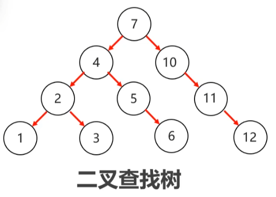

二叉查找树在插入节点时，小的放左边，大的放右边，相同的不插入

二叉查找树有个弊端，如果存放的顺序是有序的，很容易退化成链表，查找的效率会变低

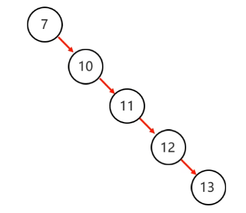

# 平衡二叉树

平衡二叉树对二叉查找树做了改进，他在二叉查找树的基础上规定**任意节点的左右子树的高度相差不能超过一**，注意是**任意节点**

平衡二叉树：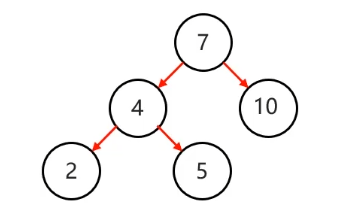

不是平衡二叉树：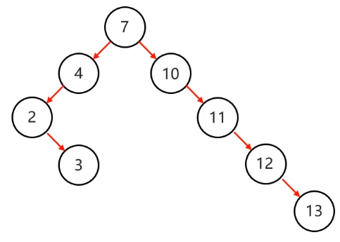

如何在添加的时候保证平衡二叉树的平衡，使任意节点的左右子树的高度相差不能超过一？

通过左旋与右旋，可以保证平衡二叉树的平衡

旋转步骤：

- 添加节点后，从添加的节点开始，不断往上寻找父节点中不平衡的节点
- 找到不平衡的节点后，以这个节点为支点，进行旋转
- 如果支点左子数的高度大于右子树，左旋，否者右旋
- 左旋把支点左旋降级为左子节点，支点原来的右节点升级为父节点，如果支点原来的右子节点有左节点，需要把这个左节点挂到支点的右子节点。
- 右旋和左旋相反

左旋：

情况一

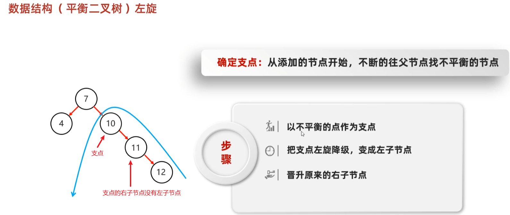

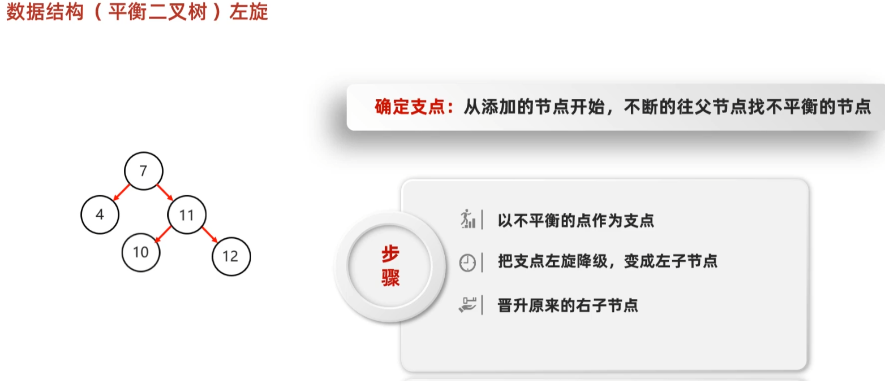

情况二：

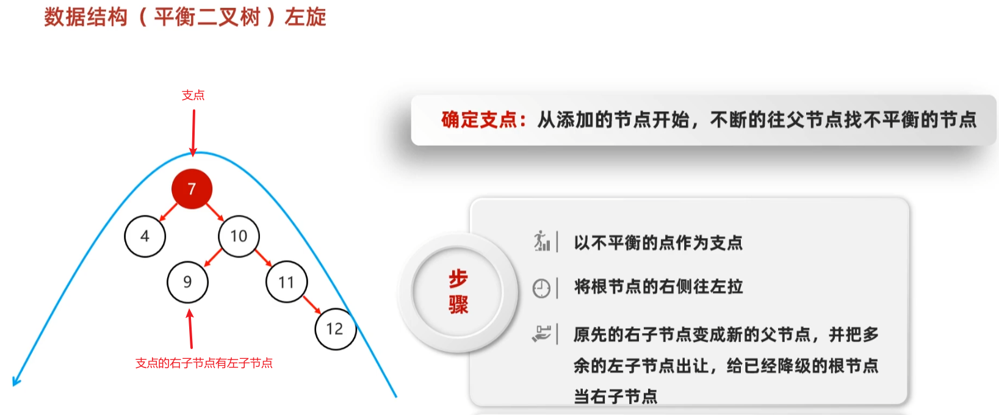

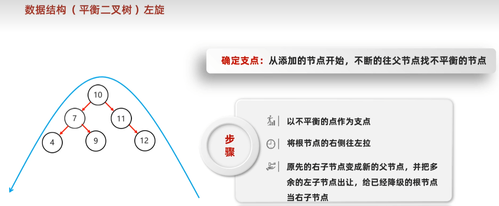

## 平衡二叉树旋转的四种情况

### 左左

一次右旋即可平衡

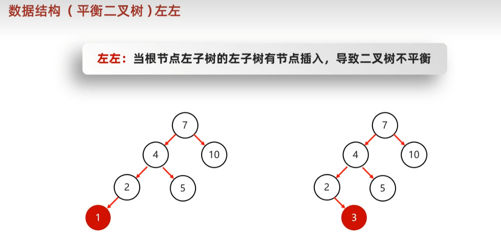

### 左右

先局部左旋，再整体右旋

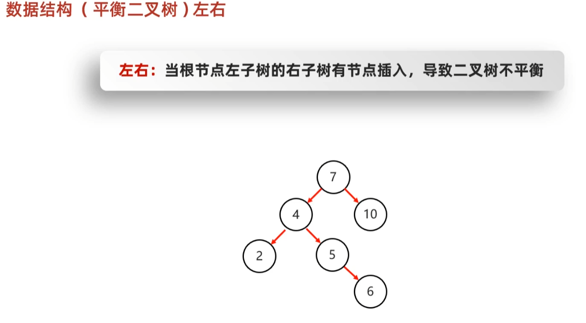

以7为支点右旋一次后仍然不平衡：

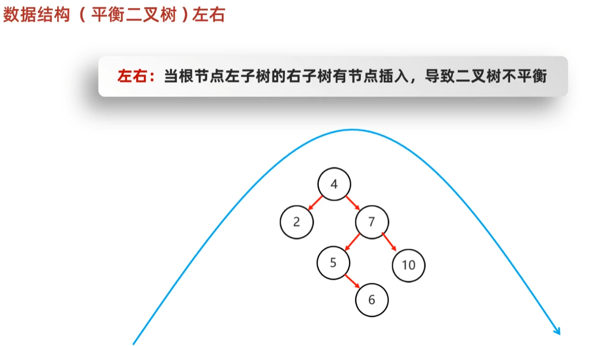

先局部左旋：

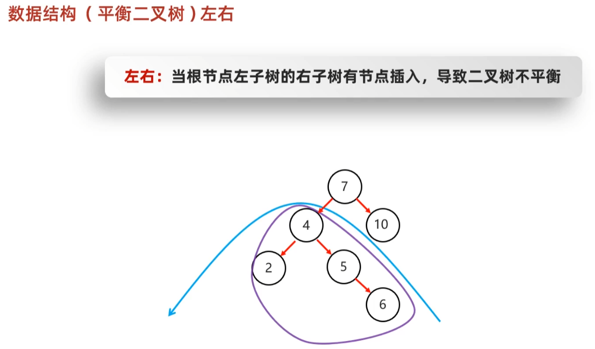

再整体右旋

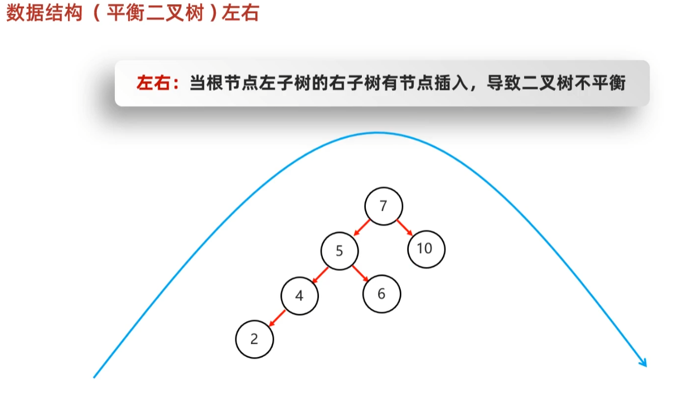

### 右右

一次左旋即可

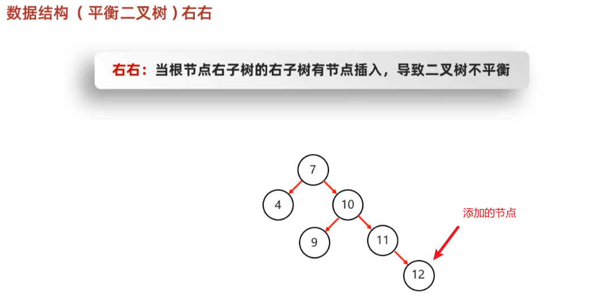

### 右左

一次局部右旋，再进行整体左旋

# 红黑树

特点：

- 红黑树是一种特殊的**二叉查找数**，它的每一个节点上都有一个存储位表示节点的颜色
- 每一个节点的颜色可以是红或黑
- 红黑树不是高度平衡的，它的平衡是通过红黑规则进行实现的

红黑规则：

- 每一个节点要么是黑色，要么是红色
- 根节点必须是黑色
- 如果一个节点没有子节点或者父节点，则该节点相应的指针属性值为Nil，这些Nil节点视为叶子节点，每个Nil节点是黑色的
- 如果一个节点是红色的，那么它的子节点必须是黑色，不会出现两个红色节点相连的情况
- 对每一个节点，从该节点到其后代所有叶节点的简单路径上，均包含相同数目的黑色节点

简单路径：从该节点到后代的叶节点，每个路径上的黑色节点数目相等

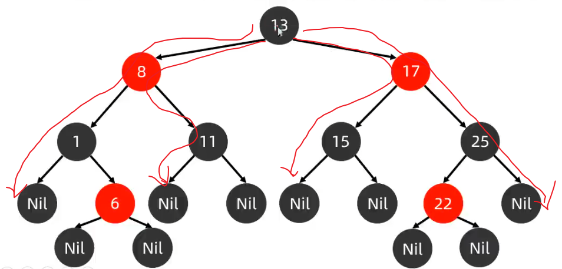

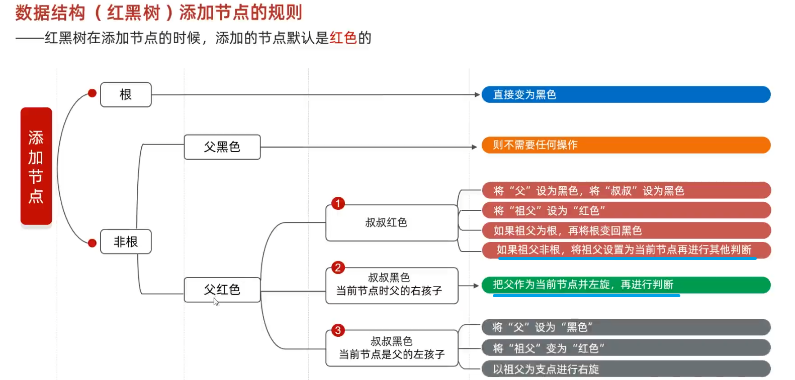