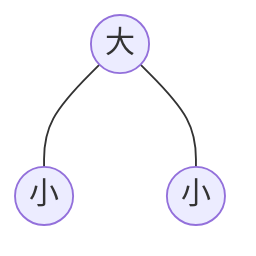
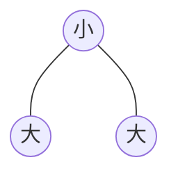
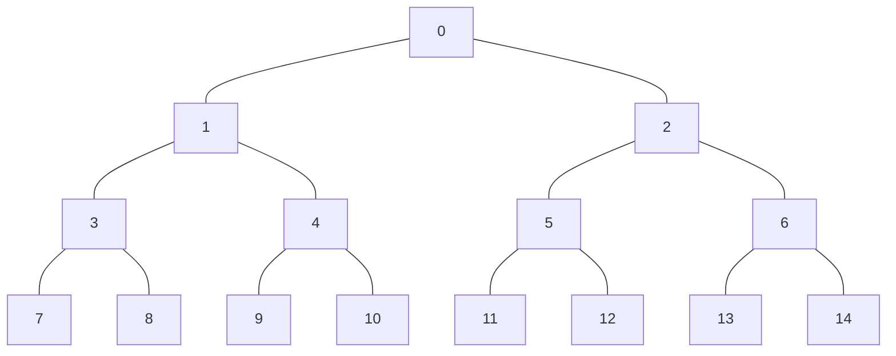
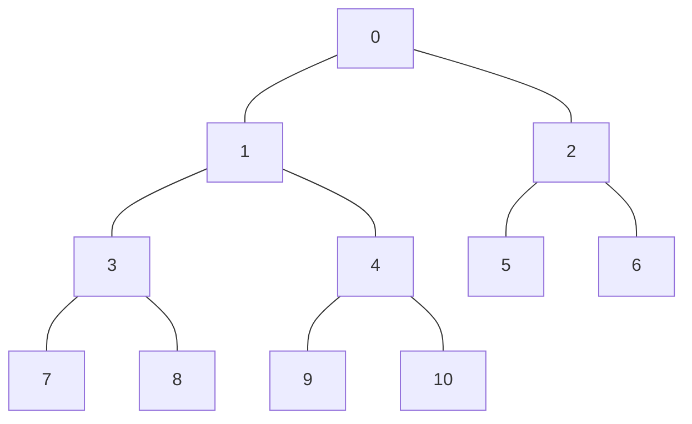

<!--
 * @Descripttion: 
 * @Author: 只会Ctrl CV的菜鸟
 * @version: 
 * @Date: 2023-01-23 12:43:50
 * @LastEditTime: 2023-01-23 16:35:21
-->
## 堆排序
堆排序通过不断构建调整大根堆或者小根堆来进行排序，大根堆小根堆：是一个**完全二叉树**，可以通过数组的形式完美定义。i从0开始时，子节点可以通过`a[(i-1)/2]`找到父节点，父节点可以通过`a[i*2+1]`找到左子节点，通过`a[i*2+2]`找到右子节点。通过构建大根堆可以从小到大。
在算法实现中，需要写一个调整函数，通过循环调用调整函数对父节点遍历，父节点的遍历自下向上，调整函数则不断从父节点向下调整（下滤）。

### 大根堆


### 小根堆

### 满二叉树：
满二叉树：满足节点数为2*k-1（k为层数）的即为满二叉树

### 完全二叉树
完全二叉树：在满二叉树的基础上，最大一层的节点可能不能够填满。完全二叉树的节点数是任意的，从形式上讲它是个缺失的的三角形，但所缺失的部分一定是右下角某个连续的部分，最后那一行可能不是完整的，对于k层的完全二叉树，节点数的范围`2^ (k - 1) -1 < N< 2^k - 1;`

设二叉树的深度为h，除第 h 层外，其它各层 (1～h-1) 的结点数都达到最大个数，第 h 层所有的结点都连续集中在最左边，
这就是完全二叉树。



C语言实现:
1. 第一次构建好大根堆
2. 把根节点和最后一个子节点交换，则得到一个最大的元素放到最后面，得到一部分有序数组
3. 对前面无序部分数组的二叉树继续构建大根堆
4. 重复2过程直到完全有序

```cpp {.line-numbers}
void heapSort(int arr[],int endNode){
    int start;
    //第一次建立大根堆
    for(start=(endNode-1)/2;start>=0;start--){
        adjusts(arr,start,endNode);
    }
    for(start=0;start<endNode;start++){
        //交换移走顶部最大的元素到后面
        swap(&arr[0],&arr[endNode-start]);
        /*
        由于只改变了头尾节点的顺序，其他节点分支还是满足大根堆的
        因此再次从根节点开始进行堆的调整，即可得到一个大根堆
        */
        adjusts(arr,0,endNode-start-1);
    }
}

/**
 * @descripttion: 调整函数，负责调整一次父节点，构造以这个父节点及其所有子节点为主体的大根堆
 * @param {int} arr 
 * @param {int} parentNode
 * @param {int} endNode
 * @return 
 */
void adjusts(int arr[],int parentNode,int endNode){
    // 父节点
    int i=parentNode;
    // 父节点的左子节点
    int j=i*2+1;
    while(j<=endNode){
        //查找最大的子节点
        if(j<endNode && arr[j]<arr[j+1]){
            j++;
        }

        if(arr[i]<arr[j]){
            swap(&arr[i],&arr[j]);
        }
        // 向下调整子节点
        i=j;
        j=2*i+1;        
    }

}

void swap(int *a,int *b){
    int temp=*a;
    *a=*b;
    *b=temp;
}
```