# 1.类图中类、接口、包的表示

## 1.1类图中表示类

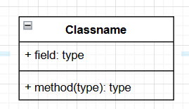

在上图中，第一层是类名字（如果要表示抽象类，把类名用斜体书写即可），第二层是类的成员变量，第三层是类的方法。成员变量以及方法前的访问修饰符用符号来表示：

- `+`表示public
- `-`表示private
- `#`表示protected
- 不带符号表示default
- `_`下划线表示static 
- 斜体表示抽象

## 1.2类图中表示接口

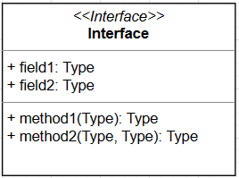

在类图中表示接口，除了在接口名字上方加上<<interface>>，其他的和类的表示都一样

## 1.3类图中表示包

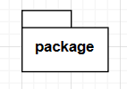

# 2.类图的关系

1. **实现关系（implementation）**
    实现关系类似java中的implements，是指类实现了接口的关系，图中用虚线加三角空心箭头表示：

    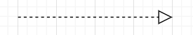

2. **泛化关系（Generalization）**
    泛化关系是指类与类之间的继承关系，例如man继承person，man是一个person，在UML类图中，泛化关系用空心三角和实线组成的箭头表示，从子类指向父类

    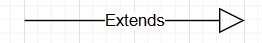

3. **关联关系（Association）**
    是指对象和对象之间的连接，它使一个对象知道另一个对象的属性和方法。在Java中，关联关系的代码表现形式为一个对象含有另一个对象的引用。也就是说，如果一个对象的类代码中，包含有另一个对象的引用，那么这两个对象之间就是关联关系。

    关联关系有单向关联和双向关联。如果两个对象都知道（即可以调用）对方的公共属性和操作，那么二者就是双向关联。如果只有一个对象知道（即可以调用）另一个对象的公共属性和操作，那么就是单向关联。大多数关联都是单向关联，单向关联关系更容易建立和维护，有助于寻找可重用的类。

    在UML图中，双向关联关系用带双箭头的实线或者无箭头的实线双线表示。单向关联用一个带箭头的实线表示，箭头指向被关联的对象，这就是导航性（Navigatity）。

    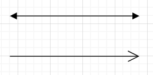

    双箭头为双向关联，单箭头为单向关联。

    关联关系又分为依赖关联、聚合关联和组合关联三种类型：

    - **依赖关系（Dependency）**

        依赖关系是一种弱关联关系。如果对象A用到对象B，但是和B的关系不是太明显的时候，就可以把这种关系看作是依赖关系。如果对象A依赖于对象B，则 A “use a” B。比如驾驶员和汽车的关系，驾驶员使用汽车，二者之间就是依赖关系。依赖关系a------>b，表示a使用b。

        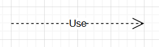

    - **聚合关系（Aggregation）**

        聚合是关联关系的一种特例，它体现的是整体与部分的拥有关系，即 “has a” 的关系。此时整体与部分之间是可分离的，它们可以具有各自的生命周期，部分可以属于多个整体对象，也可以为多个整体对象共享，所以聚合关系也常称为共享关系。例如，公司部门与员工的关系，一个员工可以属于多个部门，一个部门撤消了，员工可以转到其它部门。显然，比如a has b，那么当a消亡后，b还是能够存在的。在UML图中，聚合关系用空心菱形加实线箭头表示，空心菱形在整体一方，箭头指向部分一方。**不带箭头也可以**
        
        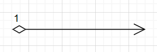
        
        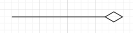
        
    - **组合关系（composition）**
    
        组合关系是比聚合关系更强的一种关系，比如a contains b，那么a是整体，b是部分，当a消亡，b也会同时消亡。此时整体与部分是不可分的，部分也不能给其它整体共享，作为整体的对象负责部分的对象的生命周期。在UML图中，组合关系用实心菱形加实线箭头表示，实心菱形在整体一方，箭头指向部分一方。**不带箭头也可以**
    
        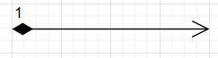
    
        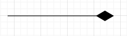
    
        在Java代码形式上，聚合和组合关系中的部分对象是整体对象的一个成员变量。但是，在实际应用开发时，两个对象之间的关系到底是聚合还是组合，有时候很难区别。在Java中，仅从类代码本身是区分不了聚合和组合的。如果一定要区分，那么如果在删除整体对象的时候，必须删掉部分对象，那么就是组合关系，否则可能就是聚合关系。从业务角度上来看，如果作为整体的对象必须要部分对象的参与，才能完成自己的职责，那么二者之间就是组合关系，否则就是聚合关系。
    
        例如，汽车与轮胎，汽车作为整体，轮胎作为部分。如果用在二手车销售业务环境下，二者之间就是聚合关系。因为轮胎作为汽车的一个组成部分，它和汽车可以分别生产以后装配起来使用，但汽车可以换新轮胎，轮胎也可以卸下来给其它汽车使用。如果用在驾驶系统业务环境上，汽车如果没有轮胎，就无法完成行驶任务，二者之间就是一个组合关系。

# 示例

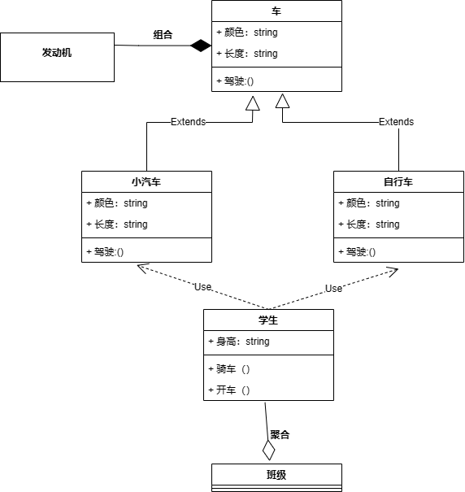