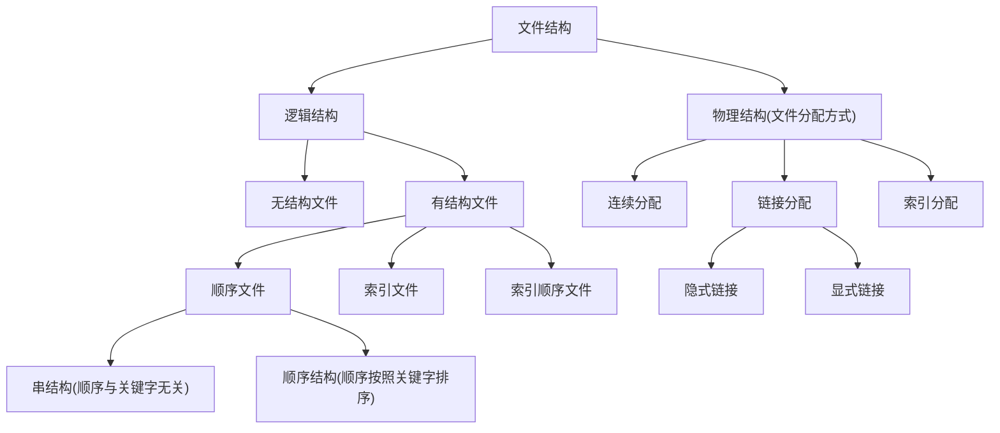

# 文件结构

```mermaid
graph TB
a1[文件结构]
a2[逻辑结构]
a3["物理结构(文件分配方式)"]
a1--> a2 & a3
b1[无结构文件]
b2[有结构文件]
b3[连续分配]
b4[链接分配]-->隐式链接 & 显式链接
b5[索引分配]
a2-->b1 & b2
a3-->b3 & b4 & b5
c1[顺序文件]
c2[索引文件]
c3[索引顺序文件]
b2-->c1 & c2 & c3
d1["串结构(顺序与关键字无关)"]
d2["顺序结构(顺序按照关键字排序)"]
c1--> d1 & d2
```

