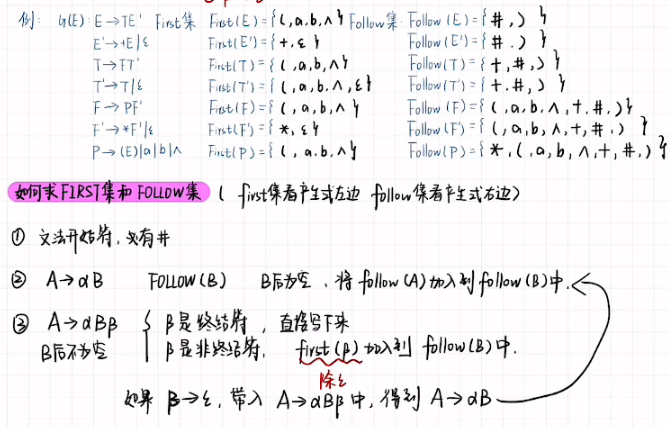
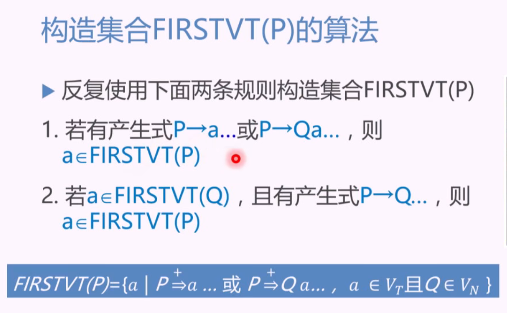
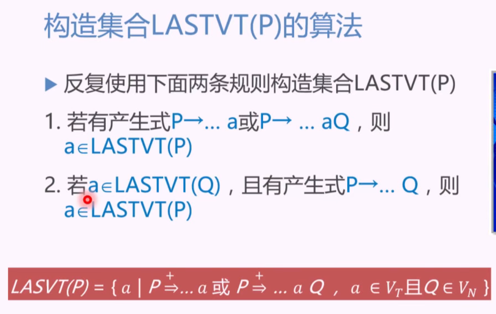
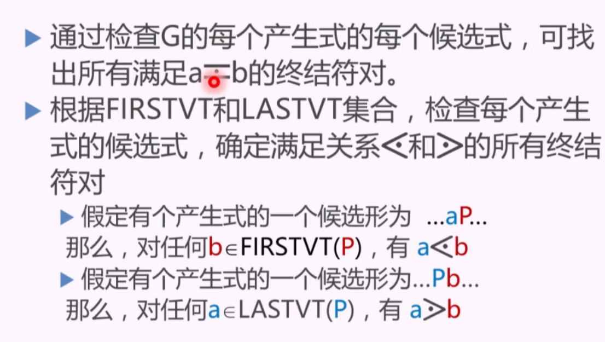
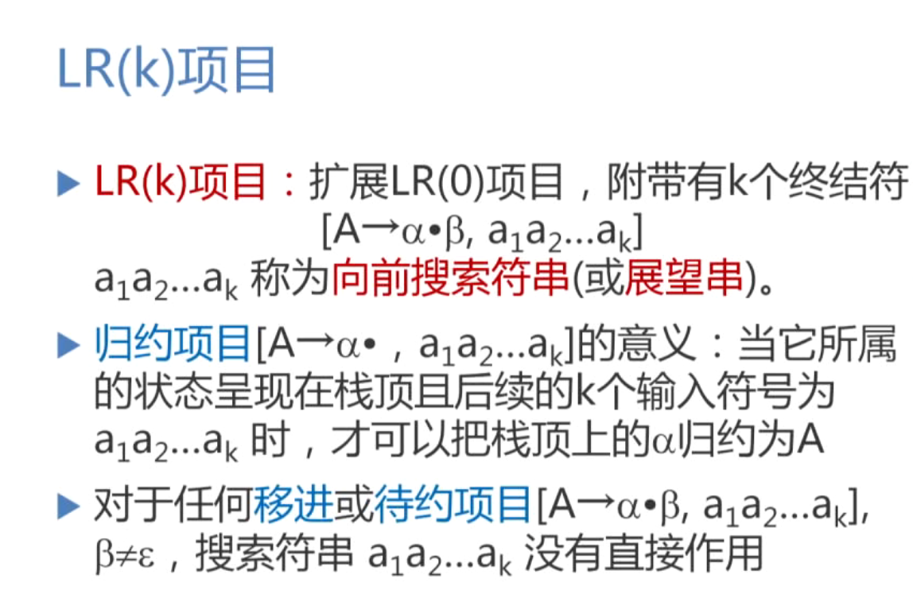
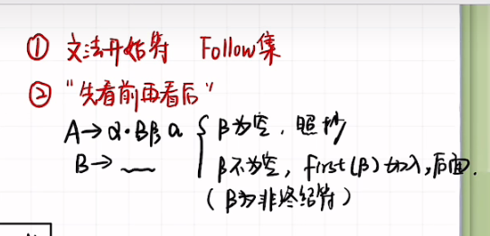
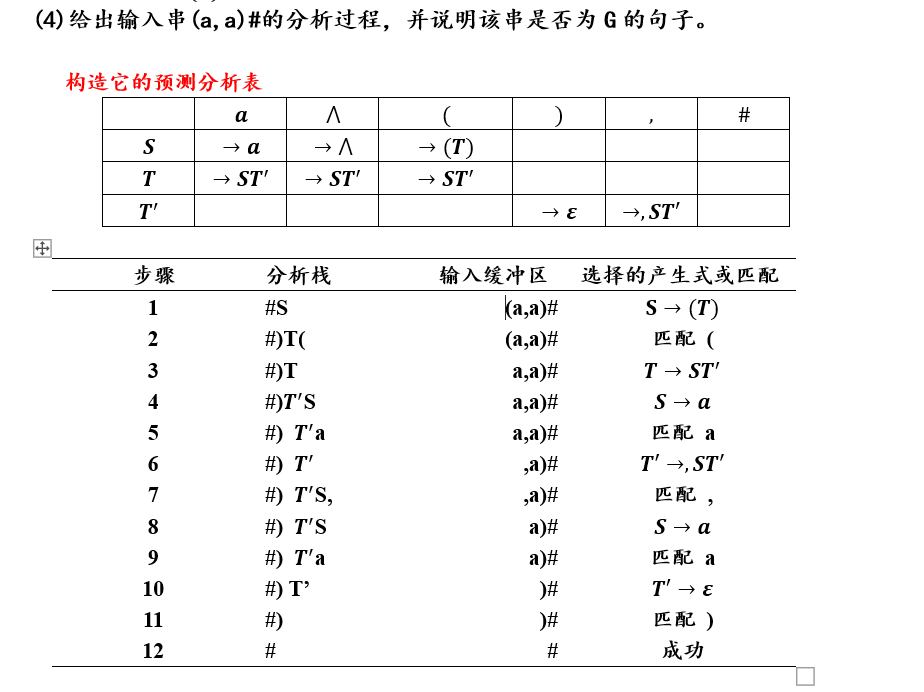
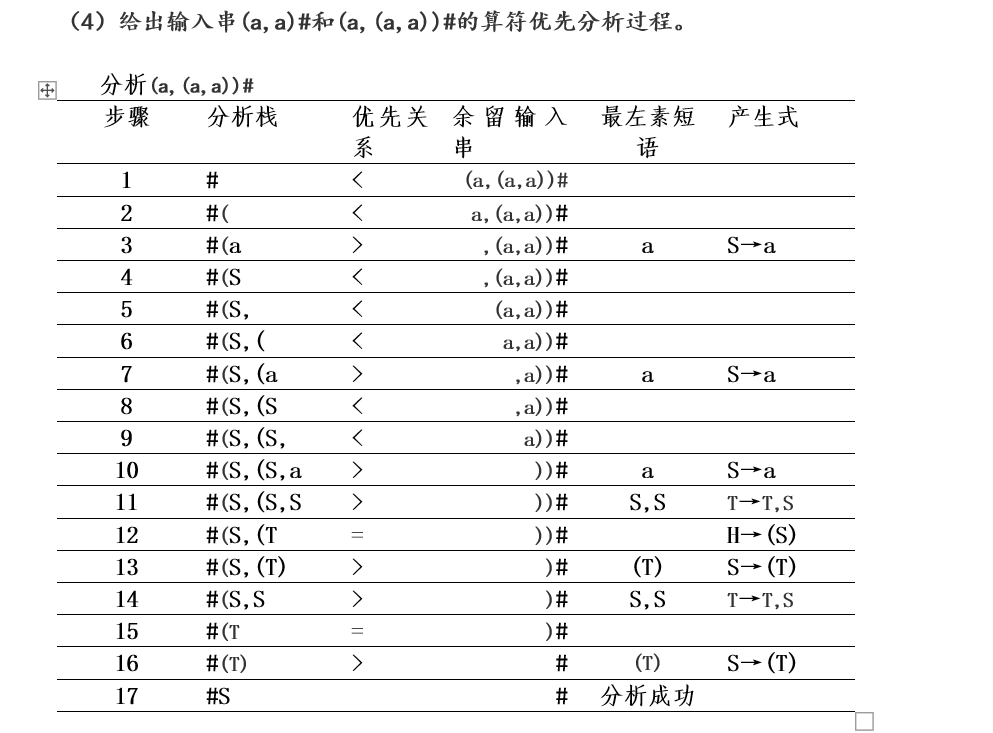
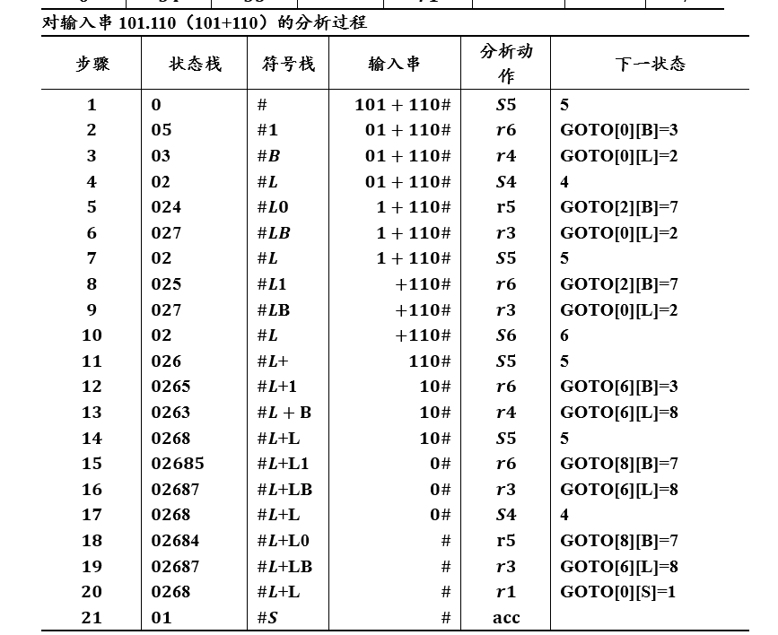

FIRST(A)表示可以由A推导出的第一个字符组成的集合，包括ε

FOLLOW(A)表示紧跟在A后面的第一个字符组成的集合，不包括ε

如果S->...A，即A在产生式的最右边，那么文法的开始符#、结束符#，肯定也在FOLLOW(A)中

**什么是产生式的SELECT集?**

SELECT集它确定了由产生式可以推出的下一个字符，即由产生式可以推出的第一个非终结符组成了一个产生式的SELECT集。

如果A不能推出ε，那么A的first集就是这个产生式的select集

**同时如果产生式S->A,再由A推出ε，那么A的FIREST集(不包含ε)和S的FOLLOW集也在这个产生式的select集中**，也就是额外加上S的follow集。

如果A本身就是一个终结符，这个产生式的select集就只有这个终结符。

FIRSTVT集合考虑的是求出产生式左边的第一个终结符

LASTVT集合考虑的是求出产生式右边的第一个终结符

