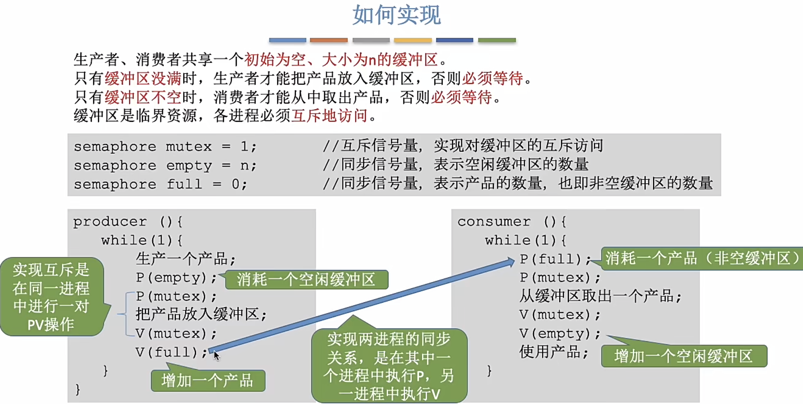
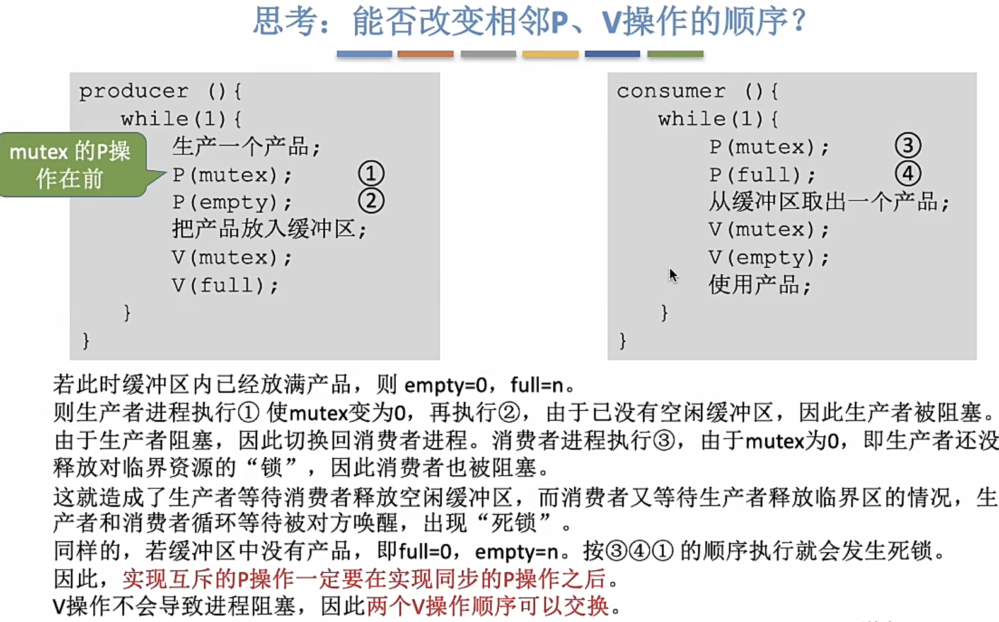

<!--
 * @Descripttion: 
 * @Author: 只会Ctrl CV的菜鸟
 * @version: 
 * @Date: 2023-02-07 21:49:54
 * @LastEditTime: 2023-02-09 16:12:03
-->
# 一前一后的同步关系
实现一前一后的进程同步关系，需要设置一个信号量，初值为0，在p1代码中执行V操作，p2代码执行P操作。信号量初值为0，因此只有p1代码V操作把信号量加一后才会唤醒p2的代码执行
# 生产者消费者

同步信号量需要看资源的数量来决定，互斥信号量一般设置为1

# 死锁

**死锁构成的四个必要条件：**
- 互斥条件
只有对必须互斥使用的资源的争抢才导致死锁，进程由于一直得不到需要的资源而死锁
- 不剥夺条件
进程所获得的资源在未使用完成前不可以被其他进程剥夺
- 请求和保持条件
进程已经有了一部分资源，又请求其他资源，而其他资源又被其他进程占有，双方互相占有资源不释放，导致死锁
- 循环等待条件（必要不充分条件）
存在一种进程资源的循环等待链，链中的每一个进程已获得的资源同时被下一个进程所请求
## 处理死锁的策略
**1. 预防死锁**
破坏死锁产生条件的一个或几个
**2. 避免死锁**
用某种方法避免死锁的发生（银行家算法）
**3. 死锁检测与解除**
允许死锁发生，不过操作系统会有方法进行死锁的检测，检测到了就采取一定的方法解除死锁。

不允许死锁发生：预防死锁、避免死锁
允许死锁发生：死锁检测与解除

## 处理死锁的方法
### 预防死锁
- 破坏互斥条件：
例如SPOOLing技术把物理上的独占设备改成逻辑上的共享设备
- 破坏不剥夺条件
方案一：进程请求不到资源，主动释放自己的资源，以后再重新申请
方案二：考虑优先级，优先级高的进程需要的资源得不到满足，剥夺优先级低的进程的资源给它
方案一可能导致饥饿
- 破坏请求和保持条件
静态分配法：在进程运行前一次分配完整资源，运行后不再进行资源的请求。
该方法可能导致饥饿，同时系统资源利用率低
- 破坏循环等待条件
顺序资源分配法：首先给资源进行编号，规定每一个进程必须按照编号递增的顺序进行资源的请求，编号相同的资源一次请求完。

### 避免死锁
